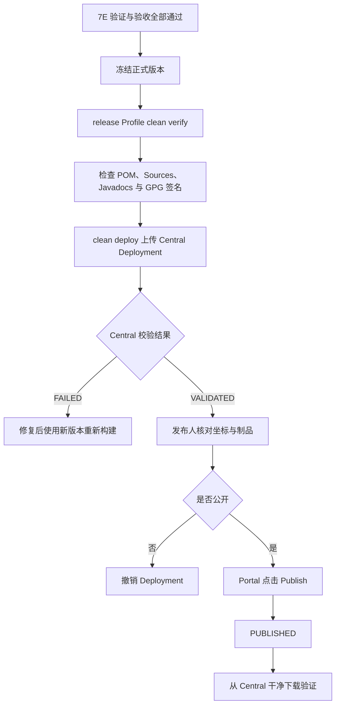

# Letool 打印框架 Maven Central 手动发布教程

本文记录 Letool 打印框架发布到 Maven Central 的完整操作。教程以 Windows、PowerShell、IDEA、Maven 3.9.13 和 Kleopatra 为例，也给出了命令行等价操作。

当前发布坐标为：

```text
groupId: io.github.leylaragg
artifactId: letool-starter-print-spring-boot
version: 由根 pom.xml 统一管理
```

> Maven Central 中已经公开的版本不能覆盖、替换或删除。每次正式发布前都要确认版本号没有使用过，并在 Portal 中完成最后一次人工检查。

## 1. 先理解整个发布流程

一次完整发布分成下面几个环节：



本项目配置了 `autoPublish=false`，所以 `mvn deploy` 只负责上传并等待校验通过，不会自动公开制品。真正不可撤销的动作是 Central Portal 中的 `Publish`。

这份教程对应独立的 7F 发布阶段。进入本页前，应先按[动态打印验证与验收指南](dynamic-print-verification-guide.md)完成 7E；测试阶段不得顺手执行 `deploy`。

## 2. 当前打印框架会发布哪些模块

Letool 全仓使用统一版本，但打印框架仍按明确的发布闭包上传下面 8 个 Maven 组件：

```text
letool-exception-core
letool-starter-exception
letool-starter-print
letool-starter-print-pdf
letool-starter-print-template
letool-starter-print-xml
letool-starter-print-expression-spel
letool-starter-print-spring-boot
```

不要为 Central 发布命令追加 `-am`。8 个模块已经覆盖打印框架需要的异常基础设施和全部打印制品，Flatten POM会移除对根 POM的依赖。也不能只上传最外层 Starter，否则消费者解析内部依赖时会缺少对应组件。

## 3. 首次发布前只需配置一次

### 3.1 注册并确认 Namespace

登录 [Maven Central Publisher Portal](https://central.sonatype.com/)，确认 `io.github.leylaragg` 已经处于 Verified 状态。

Namespace 决定了可以发布的 `groupId` 范围。已验证 `io.github.leylaragg` 后，可以发布：

```text
io.github.leylaragg
io.github.leylaragg.xxx
```

Java 包名不属于 Central 的权限校验对象，但 Letool 已统一采用 `io.github.leylaragg`，可以保持坐标和源码包结构一致。

### 3.2 生成 Central Portal User Token

进入 Central Portal 的 Account 页面，生成 User Token。Central Maven 插件使用的是 Token Username 和 Token Password，不是网页登录密码。

建议把凭据放在用户级 Maven 配置：

```text
%USERPROFILE%\.m2\settings.xml
```

当前开发机也可以继续使用 Maven 安装目录中的配置：

```text
D:\Program Files\apache-maven-3.9.13\conf\settings.xml
```

两种位置选择一种即可，IDEA 和终端必须读取同一份配置。`settings.xml` 中的结构如下：

```xml
<settings>
    <servers>
        <server>
            <id>central</id>
            <username>这里填写 Token Username</username>
            <password>这里填写 Token Password</password>
        </server>
    </servers>
</settings>
```

`id`、`username` 和 `password` 必须在同一个 `<server>` 中。不要把 Token 写入项目 POM、Git 仓库、发布脚本或聊天记录。Token 一旦出现在终端输出、截图或聊天记录中，应立即在 Central Portal 撤销并重新生成；删除本地记录或归档任务不能恢复凭证安全。

执行下面的命令，确认 Maven 能读取配置：

```powershell
mvn help:effective-settings -DshowPasswords=false
```

检查结果时应满足：

- 能看到 ID 为 `central` 的 Server。
- 不出现 `Unrecognised tag`。
- 输出中不会暴露明文密码。

### 3.3 准备 GPG 密钥

当前 Letool 使用下面这个主密钥完整指纹签名：

```text
8A40F93C7A6B1705E8F9C4CCB9D2FD1A0EBBAF61
```

Kleopatra 中显示的两个密钥用途不同：

```text
8A40...AF61  主密钥，用途为认证、签名，本项目使用它
02F2...8D14  加密子密钥，不用于 Maven 制品签名
```

完整指纹是公开标识，不是私钥，也不是密码。真正需要保护的是本机私钥和私钥口令。

先在终端中检查 GPG 和私钥：

```powershell
gpg --version
gpg --list-secret-keys 8A40F93C7A6B1705E8F9C4CCB9D2FD1A0EBBAF61
```

再把公钥发送到公钥服务器，Central 才能验证 `.asc` 签名：

```powershell
gpg --keyserver keyserver.ubuntu.com --send-keys 8A40F93C7A6B1705E8F9C4CCB9D2FD1A0EBBAF61
```

发布时 GPG 通常会弹出口令输入窗口。让 `gpg-agent` 或 Kleopatra 负责口令交互即可，不要把口令放在 Maven 命令中。

### 3.4 检查 IDEA 的 Maven 设置

在 IDEA 中打开：

```text
Settings
  → Build, Execution, Deployment
  → Build Tools
  → Maven
```

确认以下配置：

- Maven home path 指向实际使用的 Maven，例如 `D:\Program Files\apache-maven-3.9.13`。
- User settings file 指向保存 Central Token 的 `settings.xml`。
- Local repository 使用当前开发机正常可写的 Maven 本地仓库。
- Maven Runner 使用 JDK 17 或项目配置的兼容 JDK。

IDEA 与 PowerShell 使用不同 Maven 或不同 `settings.xml`，是“命令行能上传、IDEA 却提示 401”的常见原因。

## 4. 项目中已经准备好的发布配置

根 `pom.xml` 已经提供 Maven Central 所需的项目名称、描述、URL、许可证、开发者和 SCM 信息。`release` Profile 会先生成可独立解析的消费 POM，再准备源码包、Javadoc 包和 GPG 签名，最后通过 Central Maven 插件上传：

```xml
<profile>
    <id>release</id>
    <build>
        <plugins>
            <!-- flatten-maven-plugin：解析父级元数据和依赖版本 -->
            <!-- maven-source-plugin：生成 sources.jar -->
            <!-- maven-javadoc-plugin：生成 javadoc.jar -->
            <!-- maven-gpg-plugin：为发布文件生成 .asc 签名 -->
            <plugin>
                <groupId>org.sonatype.central</groupId>
                <artifactId>central-publishing-maven-plugin</artifactId>
                <version>0.11.0</version>
                <extensions>true</extensions>
                <configuration>
                    <publishingServerId>central</publishingServerId>
                    <autoPublish>false</autoPublish>
                    <waitUntil>validated</waitUntil>
                </configuration>
            </plugin>
        </plugins>
    </build>
</profile>
```

JAR 模块发布时使用扁平 POM，不依赖父 POM 已经在 Central 公开；根聚合 POM仍保留 `dependencyManagement`，可以继续承担版本管理职责。日常发布不需要反复修改这段配置，只有插件升级、Central 规则变化或发布范围调整时才需要改 POM。

## 5. 每次发布前的检查

### 5.1 确认工作区和分支

```powershell
git status --short --branch
```

建议只从确认过的 `main` 提交发布。发布命令会使用本地工作区内容，未提交的修改同样会进入制品，因此不能只看远程仓库。

### 5.2 确认版本号

Letool 使用全仓统一版本。根 `pom.xml` 的项目版本和内部依赖版本必须保持一致：

```xml
<version>3.0.2</version>
<letool.version>3.0.2</letool.version>
```

全部子模块继承同版本根 POM，打印和规则引擎不再声明独立项目版本。发布新版本时需要统一调整全仓版本，不能覆盖已经公开的坐标。

可以先访问对应 POM 判断版本是否已经公开。下面以 `3.0.2` 为例：

```powershell
$releaseVersion = '3.0.2'
$pomUrl = "https://repo1.maven.org/maven2/io/github/leylaragg/letool-starter-print-spring-boot/$releaseVersion/letool-starter-print-spring-boot-$releaseVersion.pom"
curl.exe -I $pomUrl
```

- HTTP 200：该版本已经公开，必须更换版本号。
- HTTP 404：公开仓库中暂时没有该版本，但仍需到 Central Portal 检查是否存在尚未 Publish 的同版本 Deployment。

### 5.3 验证普通本地安装

EDC 使用本地版本联调时，应从仓库根目录安装完整打印依赖闭包：

```powershell
mvn -pl letool-starter-print-spring-boot -am clean install
```

这里的 `-am` 只用于本地安装，它会同时安装同为 `3.0.2` 的根 POM、异常模块和打印模块。安装后再从独立消费者检查依赖树，不能只根据 Reactor 构建成功判断本地接入版本。

### 5.4 确认发布范围

打印框架使用明确的 8 模块清单，避免 `-am` 把其他同版本模块带入 Central Deployment：

```powershell
$printModules = 'letool-exception-core,letool-starter-exception,letool-starter-print,letool-starter-print-pdf,letool-starter-print-template,letool-starter-print-xml,letool-starter-print-expression-spel,letool-starter-print-spring-boot'
```

8 个模块全部交给同一个 Reactor 后，Maven 会按依赖顺序构建异常基础设施和打印框架，生成的公开 POM会把内部依赖统一固化为 `3.0.2`。

### 5.5 确认敏感信息没有进入仓库

```powershell
git diff --cached
git status --short
```

重点检查：

- 没有 Central Token。
- 没有 GPG 私钥或私钥口令。
- 没有临时导出的密钥文件。
- POM、README、许可证和 SCM 地址正确。

## 6. 先做本地发布验证

在 Letool 仓库根目录执行：

```powershell
$printModules = 'letool-exception-core,letool-starter-exception,letool-starter-print,letool-starter-print-pdf,letool-starter-print-template,letool-starter-print-xml,letool-starter-print-expression-spel,letool-starter-print-spring-boot'
mvn -P release -pl $printModules "-Dgpg.keyname=8A40F93C7A6B1705E8F9C4CCB9D2FD1A0EBBAF61" clean verify
```

双引号可以防止 PowerShell 把带点号的 Maven 属性拆开。IDEA Maven Run Configuration 中可以直接填写相同参数，但需要把 `$printModules` 替换成完整模块清单。

这一步应完成：

- 编译打印框架依赖闭包。
- 执行测试。
- 生成主 JAR、源码包和 Javadoc 包。
- 生成 POM 与制品的 `.asc` 签名。
- 不向 Central 上传任何内容。

普通 JAR 模块的 `target` 目录中应出现：

```text
<artifactId>-<version>.jar
<artifactId>-<version>-sources.jar
<artifactId>-<version>-javadoc.jar
<artifactId>-<version>.pom
上述发布文件对应的 .asc 签名
```

根聚合模块的 packaging 是 `pom`，没有主 JAR 属于正常情况。

可以抽查一个签名：

```powershell
gpg --verify letool-starter-print-spring-boot\target\letool-starter-print-spring-boot-3.0.2.jar.asc letool-starter-print-spring-boot\target\letool-starter-print-spring-boot-3.0.2.jar
```

看到 `Good signature` 才表示签名验证成功。命令中的版本号要换成当次发布版本。

## 7. 正式上传到 Central

完成本地验证并确认版本可以公开后，在仓库根目录执行：

```powershell
$printModules = 'letool-exception-core,letool-starter-exception,letool-starter-print,letool-starter-print-pdf,letool-starter-print-template,letool-starter-print-xml,letool-starter-print-expression-spel,letool-starter-print-spring-boot'
mvn -P release -pl $printModules "-Dgpg.keyname=8A40F93C7A6B1705E8F9C4CCB9D2FD1A0EBBAF61" clean deploy
```

如果使用 CMD、Git Bash 或其他终端，可以直接展开模块清单：

```shell
mvn -P release -pl letool-exception-core,letool-starter-exception,letool-starter-print,letool-starter-print-pdf,letool-starter-print-template,letool-starter-print-xml,letool-starter-print-expression-spel,letool-starter-print-spring-boot -Dgpg.keyname=8A40F93C7A6B1705E8F9C4CCB9D2FD1A0EBBAF61 clean deploy
```

不要为了省时间默认添加 `-DskipTests`。正式上传前重新跑完整测试，可以避免本地验证后代码又发生变化。

### 7.1 怎样判断上传成功

日志应同时出现类似内容：

```text
BUILD SUCCESS
Uploaded bundle successfully
deploymentId: xxxxxxxx-xxxx-xxxx-xxxx-xxxxxxxxxxxx
Deployment ... has been validated
```

请保存 `deploymentId`。它是 Portal 中查找本次 Deployment、排查失败和请求 Central 支持时最重要的编号。

插件生成的上传包位于：

```text
target\central-publishing\central-bundle.zip
```

可以检查文件是否存在：

```powershell
Get-Item .\target\central-publishing\central-bundle.zip
```

### 7.2 上传成功不等于已经公开

本项目的日志会提示 `has been validated`。这代表 Central 已接受并校验制品，状态是 `VALIDATED`，但用户还不能从 Maven Central 下载。

只有 Portal 中点击 `Publish` 并最终进入 `PUBLISHED` 后，组件才算正式公开。

## 8. 使用 IDEA 完成 verify 和 deploy

推荐为发布建立 Maven Run Configuration，不要只在某个子模块的 Lifecycle 下直接双击 `deploy`，因为那种方式不容易确认完整模块清单和 `release` Profile。

### 8.1 建立本地验证配置

在 IDEA 中打开：

```text
Run
  → Edit Configurations
  → +
  → Maven
```

填写：

```text
Name: Letool Print Release Verify
Working directory: D:\Program Files\Ailind Projects\letool
Command line: -P release -pl letool-exception-core,letool-starter-exception,letool-starter-print,letool-starter-print-pdf,letool-starter-print-template,letool-starter-print-xml,letool-starter-print-expression-spel,letool-starter-print-spring-boot -Dgpg.keyname=8A40F93C7A6B1705E8F9C4CCB9D2FD1A0EBBAF61 clean verify
```

运行后检查测试、Javadoc 和 GPG 签名。IDEA 配置中的 Command line 不需要写开头的 `mvn`，也不需要 PowerShell 的 `--%`。

### 8.2 建立正式上传配置

复制上一份配置并修改：

```text
Name: Letool Print Central Deploy
Working directory: D:\Program Files\Ailind Projects\letool
Command line: -P release -pl letool-exception-core,letool-starter-exception,letool-starter-print,letool-starter-print-pdf,letool-starter-print-template,letool-starter-print-xml,letool-starter-print-expression-spel,letool-starter-print-spring-boot -Dgpg.keyname=8A40F93C7A6B1705E8F9C4CCB9D2FD1A0EBBAF61 clean deploy
```

运行时可能出现 Kleopatra 或 pinentry 口令窗口。输入私钥口令后等待 Maven 输出 Deployment ID 和 `VALIDATED`。

IDEA Maven 工具窗口中的 Profiles 也可以勾选 `release`，但 Run Configuration 把完整参数保存在一起，更适合作为以后重复执行的发布入口。

## 9. 在 Central Portal 中人工 Publish

上传并验证通过后，打开：

[Central Publishing Deployments](https://central.sonatype.com/publishing/deployments)

按以下顺序操作：

1. 使用 `deploymentId` 找到本次 Deployment。
2. 确认状态为 `VALIDATED`。
3. 核对 Namespace、版本号和组件数量。
4. 检查 2 个异常模块、6 个打印模块、源码包、Javadoc 包和签名均在本次 Deployment 中。
5. 确认没有上传规则引擎或其他不属于当次范围的模块。
6. 没有问题后点击 `Publish`。
7. 等待状态从 `PUBLISHING` 变为 `PUBLISHED`。

如果发现版本、组件或元数据不正确，不要点击 `Publish`。可以 Drop 这次 Deployment，修复后使用新的构建重新上传。若准备向 Central Support 报告校验问题，先保留失败 Deployment，方便对方查看文件和错误信息。

## 10. 发布后的验证

### 10.1 检查 Maven Central 文件

以 `3.0.2` 为例：

```powershell
$releaseVersion = '3.0.2'
$pomUrl = "https://repo1.maven.org/maven2/io/github/leylaragg/letool-starter-print-spring-boot/$releaseVersion/letool-starter-print-spring-boot-$releaseVersion.pom"
curl.exe -I $pomUrl
```

同步完成后应返回 HTTP 200。Portal 已显示 `PUBLISHED` 但仓库仍是 404 时，先等待同步，不要重新上传同一版本。

### 10.2 使用干净的 Maven 解析验证

```powershell
mvn -U dependency:get -Dartifact=io.github.leylaragg:letool-starter-print-spring-boot:3.0.2
```

若要排除本地仓库缓存影响，可以在临时目录中创建一个最小 Spring Boot 消费项目，再声明：

```xml
<dependency>
    <groupId>io.github.leylaragg</groupId>
    <artifactId>letool-starter-print-spring-boot</artifactId>
    <version>3.0.2</version>
</dependency>
```

随后执行：

```powershell
mvn -U clean test
```

验证成功后，再为源码提交创建与版本一致的 Git Tag，并补充发布说明。

## 11. 常见问题排查

### 11.1 `401 Unauthorized` 或找不到 `central` 凭据

依次检查：

1. Token 是否来自 Central Portal，而不是登录密码。
2. `<id>central</id>` 是否位于 `<server>` 内。
3. POM 的 `publishingServerId` 是否也是 `central`。
4. IDEA 和终端是否读取同一份 `settings.xml`。
5. Token 是否被重新生成；重新生成后旧 Token 可能不再适用。

### 11.2 `Unrecognised tag: 'id'`

说明 `<id>` 被写成了 `<servers>` 的直接子节点。正确结构必须是：

```xml
<servers>
    <server>
        <id>central</id>
        <username>...</username>
        <password>...</password>
    </server>
</servers>
```

### 11.3 Maven 找不到 GPG 私钥

```powershell
gpg --list-secret-keys 8A40F93C7A6B1705E8F9C4CCB9D2FD1A0EBBAF61
```

如果没有结果，确认 IDEA/Maven 是否运行在拥有该私钥的 Windows 用户下。不要改用短 Key ID 掩盖 keyring 配置问题。

### 11.4 GPG 不弹出口令窗口或签名卡住

先在普通终端执行一次签名或查看私钥，让 `gpg-agent` 和 pinentry 正常启动。仍然失败时，检查 Kleopatra 使用的 GnuPG 与 Maven 调用的 `gpg` 是否是同一套安装。

不要把私钥口令拼到命令行。命令行历史、IDEA 日志和进程列表都可能留下它。

### 11.5 Central 提示找不到公钥

重新发送主密钥公钥：

```powershell
gpg --keyserver keyserver.ubuntu.com --send-keys 8A40F93C7A6B1705E8F9C4CCB9D2FD1A0EBBAF61
```

等待公钥服务器同步后重新创建 Deployment。不要使用只有“加密”用途的子密钥指纹。

### 11.6 缺少 sources、Javadoc 或签名

确认命令包含 `-P release`，并检查 `release` Profile 是否仍配置：

- `maven-source-plugin`
- `maven-javadoc-plugin`
- `maven-gpg-plugin`
- `central-publishing-maven-plugin`

Central Maven 插件负责打包和上传，但不会替项目自动补齐源码包、Javadoc 和 POM 元数据。

### 11.7 Portal 校验失败

打开 Deployment 的 Validation Results，根据具体错误修改项目。常见原因包括：

- POM 缺少名称、描述、URL、许可证、开发者或 SCM 信息。
- POM 仍依赖尚未公开的父 POM，导致继承元数据和依赖版本无法解析。
- JAR 缺少 sources 或 Javadoc。
- `.asc` 无法通过已发布公钥验证。
- `groupId` 不在已验证 Namespace 下。
- 某个相同坐标和版本已经发布。

如果同一次出现“Project URL is not defined”“License information is missing”“SCM URL is not defined”“Developers information is missing”和多条“Dependency version information is missing”，先检查模块发布 POM是否仍包含 `<parent>`，以及 `release` Profile 是否执行了 `flatten-maven-plugin`。修复后重新执行 `clean verify` 和 `clean deploy`。不要尝试覆盖已经 `PUBLISHED` 的版本。

### 11.8 构建成功，但 Portal 中出现了不该发布的模块

检查 `-pl` 是否完整列出 2 个异常模块和 6 个打印模块，并确认 Central 发布命令中没有 `-am`。上传之前查看 Reactor Build Order；如果出现根 POM、规则引擎或其他模块，就不应继续上传。

如果 Deployment 还没有 Publish，直接 Drop，修正范围后重新上传。

## 12. 一页式日常发布清单

以后发布打印框架，可以按下面这份清单操作：

```text
[ ] 1. 确认 main 工作区内容就是准备发布的代码
[ ] 2. 统一修改根项目、letool.version 和全部子模块的父 POM版本
[ ] 3. 确认新版本未在 Maven Central 和 Portal 使用
[ ] 4. 确认 settings.xml 中 central Token 可用
[ ] 5. 确认主密钥 8A40...AF61 的私钥和公钥可用
[ ] 6. 执行 clean verify
[ ] 7. 检查测试、sources、Javadoc、POM 和 .asc
[ ] 8. 执行 clean deploy
[ ] 9. 保存 deploymentId，确认状态为 VALIDATED
[ ] 10. Portal 中核对 8 个组件并点击 Publish
[ ] 11. 等待 PUBLISHED，并从 repo1.maven.org 下载验证
[ ] 12. 创建 Git Tag 和发布说明
```

对应的两条核心命令是：

```powershell
$printModules = 'letool-exception-core,letool-starter-exception,letool-starter-print,letool-starter-print-pdf,letool-starter-print-template,letool-starter-print-xml,letool-starter-print-expression-spel,letool-starter-print-spring-boot'
mvn -P release -pl $printModules "-Dgpg.keyname=8A40F93C7A6B1705E8F9C4CCB9D2FD1A0EBBAF61" clean verify
mvn -P release -pl $printModules "-Dgpg.keyname=8A40F93C7A6B1705E8F9C4CCB9D2FD1A0EBBAF61" clean deploy
```

## 13. 官方参考资料

- [Maven Central：Maven 插件发布方式](https://central.sonatype.org/publish/publish-portal-maven/)
- [Maven Central：发布制品要求](https://central.sonatype.org/publish/requirements/)
- [Maven Central：GPG 签名要求](https://central.sonatype.org/publish/requirements/gpg/)
- [Maven Central：注册 Namespace](https://central.sonatype.org/register/namespace/)
- [Maven Central：Publisher Portal 操作](https://central.sonatype.org/publish/publish-portal-guide/)
- [Maven Central：已发布制品不可变规则](https://central.sonatype.org/publish/requirements/immutability/)
