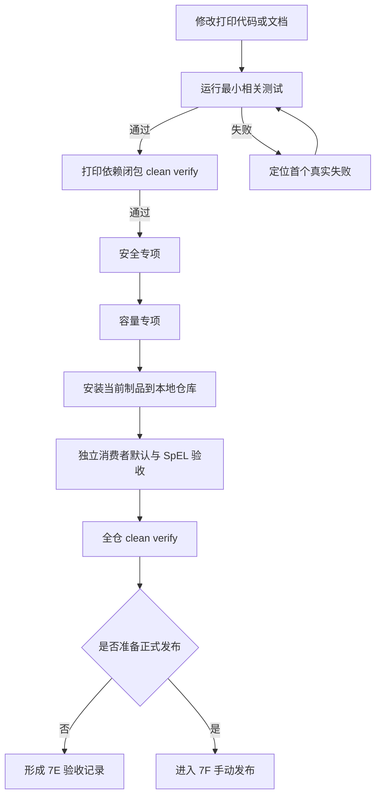
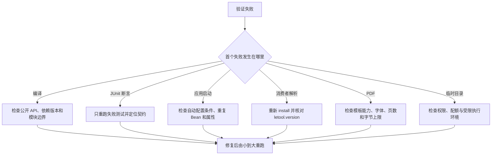

# 动态打印验证与验收指南

本文面向维护 Letool 打印框架、开发模板扩展和接入 Starter 的人员。它回答三个问题：改动后先测什么、怎样证明公开 Maven 坐标能被普通项目使用、什么时候才允许进入 Central 发布阶段。

如果只是编写 XML，先阅读[模板作者指南](dynamic-print-template-author-guide.md)；如果在宿主中准备模板和业务上下文，先看[Spring Boot Starter README](../letool-starter-print-spring-boot/README.md)；准备上线时再对照[生产运维指南](dynamic-print-production-guide.md)。

## 1. 先选择你的验证路径

| 你的角色 | 优先执行 | 还需要关注 |
|---|---|---|
| 模板作者 | 文档示例测试、相关 XML 测试 | 静态检查、PDF 能力边界 |
| 扩展开发者 | 扩展定向测试、打印闭包验证 | 并发复用、容量治理、错误脱敏 |
| 宿主开发者 | 独立消费者默认测试 | 模板仓库、数据准备、产物交付由宿主自测 |
| SpEL 使用者 | 独立消费者 `spel` Profile | 依赖和配置开关缺一不可 |
| 框架维护者 | 安全、容量、打印闭包、全仓验证 | 验收记录与暂存范围 |
| 发布人员 | 先完成本指南，再进入 7F | GPG、Central 上传与人工 Publish |



7E 到 `全仓 clean verify` 和独立消费者通过为止。本阶段不修改正式版本、不执行 GPG 签名、不上传 Central，也不点击 Portal 的 `Publish`。

## 2. 每层验证能证明什么

| 层级 | 能证明 | 不能替代 |
|---|---|---|
| 单类或单模块测试 | 本次改动附近的契约仍成立 | 依赖模块兼容和外部坐标解析 |
| 打印闭包验证 | 九个打印相关模块能从干净状态共同构建 | Letool 其他模块回归 |
| 安全专项 | 公开入口的 XML、SpEL、扩展、资源和临时文件边界 | 所有功能正确性 |
| 容量专项 | 固定大文档场景可运行并生成可比较报告 | 跨机器性能承诺和线上压测 |
| 独立消费者 | 普通 Spring Boot 项目能从 Maven 本地仓库解析公开坐标并生成 PDF | Central 已发布、EDC 等宿主业务正确 |
| 全仓验证 | 当前工作区的整个 Reactor 通过 | Central 签名、上传和公开下载 |

`verification/print-consumer` 不是根 Reactor 的模块，这正是它的价值。它不继承 Letool 父 POM，只依赖公开坐标，因此能发现“Reactor 内能编译，普通项目却缺依赖或自动配置失效”的问题。

## 3. 日常开发的最短反馈链路

先运行改动附近的测试，再扩大范围。下面示例从仓库根目录执行。

模板示例、DSL 或发布链路有变化时：

```powershell
mvn --% -pl letool-starter-print-spring-boot -am -Dtest=PrintDocumentationExampleTest -Dsurefire.failIfNoSpecifiedTests=false test
```

涉及公开入口、安全边界或错误转换时：

```powershell
mvn --% -pl letool-starter-print-spring-boot -am -Dtest=PrintSecurityRegressionTest -Dsurefire.failIfNoSpecifiedTests=false test
```

需要验证完整打印依赖闭包时：

```powershell
mvn --% -pl letool-starter-print-spring-boot -am clean verify
```

参数含义：

- `--%` 让 Windows PowerShell 不再解释后续参数；在 IDEA 或其他 Shell 中通常不需要它。
- `-pl letool-starter-print-spring-boot` 选择打印主 Starter。
- `-am` 同时构建 Starter 依赖的本仓库模块。
- `-Dsurefire.failIfNoSpecifiedTests=false` 允许 Reactor 中没有同名测试的上游模块继续构建，不会吞掉目标模块的测试失败。
- `clean verify` 会从干净产物开始执行完整生命周期；不能用旧的 `target` 目录代替。

## 4. 阶段验收的完整命令

### 4.1 安全回归

```powershell
mvn --% -pl letool-starter-print-spring-boot -am -Dtest=PrintSecurityRegressionTest -Dsurefire.failIfNoSpecifiedTests=false test
```

它从 Starter 的公开门面进入，覆盖受控 XML、include、受限 SpEL、扩展数据视图、外部资源标识、PDF 页数和临时目录清理。若修改了某个底层安全实现，还要保留其模块级单元测试，不能只依赖这一个聚合用例。

### 4.2 容量基线

```powershell
mvn --% -P print-capacity -pl letool-starter-print-spring-boot -am -Dtest=PrintCapacityBaselineTest -Dsurefire.failIfNoSpecifiedTests=false test
```

报告位于 `letool-starter-print-spring-boot/target/print-capacity/capacity-baseline.md`。比较同一环境下的成功率、页数、字节数、中位数和 P95；不要把一台开发机的耗时写成所有机器都必须达到的阈值，也不要提交生成报告。

### 4.3 独立 Maven 消费者

先把当前打印闭包安装到 Maven 本地仓库。这里的 `install` 不会访问 Central 发布接口：

```powershell
mvn --% -pl letool-starter-print-spring-boot -am -DskipTests install
```

随后单独构建消费者：

```powershell
mvn --% -f verification/print-consumer/pom.xml clean test
mvn --% -f verification/print-consumer/pom.xml -P spel clean test
```

第一条命令应证明默认 Starter 可以启动、发布并切换模板版本、流式生成 PDF，并在没有 SpEL 模块时明确拒绝 SpEL。第二条命令显式加入 SpEL 依赖和配置开关，再证明相同模板能够输出。两次日志中的 Reactor 都应只有 `print-consumer`。

消费者的完整说明见[独立消费者 README](../verification/print-consumer/README.md)。如果要临时测试另一个本地版本，可用 `-Dletool.version=版本号` 覆盖 POM 属性。

### 4.4 全仓回归

```powershell
mvn --% clean verify
```

这是 7E 的最后一道代码验证。最终记录要以本次命令的退出码和测试报告为准，不能引用前一天或修改前的结果。

## 5. 在 IDEA 中怎样操作

### 5.1 根项目

1. 在 Maven 工具窗口刷新 Letool 根项目。
2. 日常定位可直接运行对应 JUnit 类。
3. 打印闭包或全仓验收应建立 Maven Run Configuration，工作目录选择仓库根目录，并填写与第 4 节相同的 Maven 参数。
4. 不要只双击某个子模块的 `verify` 后就声称打印闭包通过；那样通常不会包含 `-am` 选中的全部依赖模块。

### 5.2 独立消费者

1. 先在根项目执行本地 `install`。
2. 右键 `verification/print-consumer/pom.xml`，选择 **Add as Maven Project**。
3. 运行 `PrintConsumerApplication` 只检查应用能够自动配置。
4. 运行 `PrintConsumerTest` 才会真正发布模板、生成 PDF 并用 PDFBox 重新读取。
5. 在消费者 Maven 项目的 Profiles 中勾选 `spel`，重新运行测试，检查选装能力。

独立消费者可以在 IDEA 中运行，但它仍不是根 Reactor 的启动测试模块。把它独立导入是为了模拟真正的外部项目，而不是遗漏了聚合配置。

## 6. 结果在哪里看

- Maven 最终结果：控制台末尾的 `BUILD SUCCESS` 或 `BUILD FAILURE`。
- 单元测试明细：各模块的 `target/surefire-reports`。
- 集成测试明细：使用 Failsafe 的模块在 `target/failsafe-reports`。
- 容量报告：`letool-starter-print-spring-boot/target/print-capacity/capacity-baseline.md`。
- 独立消费者报告：`verification/print-consumer/target/surefire-reports`。

验收记录至少写清命令、退出码、测试数、失败/错误/跳过数、容量报告摘要和已知限制。生成目录属于构建产物，不进入 Git 暂存区。

## 7. 失败时怎样分流



常见问题：

- `NoSuchMethodError`：消费者解析到了旧的本地 Letool 制品，重新执行根项目 `install`，并确认版本一致。
- “条件表达式语言未注册”：默认依赖下是预期边界；确实需要 SpEL 时同时引入模块并开启 `letool.print.spel.enabled=true`。
- 指定测试时上游模块报告“没有匹配测试”：确认命令包含 `-Dsurefire.failIfNoSpecifiedTests=false`，同时检查目标模块是否真的执行了用例。
- JUnit 临时目录出现 `AccessDeniedException`：先确认系统临时目录权限。若只在沙箱或受限代理中失败，可为该进程指定一个可写的项目临时目录；不要因此放宽生产临时目录权限。
- 容量耗时波动：先比较机器负载、JDK、字体和 PDF 依赖，再判断是否发生代码退化。

不要跳过首个失败直接反复跑全仓，也不要通过 `-DskipTests`、删除断言或扩大安全白名单让验收变绿。

## 8. 7E 验收记录模板

```text
阶段：动态打印 7E
提交范围：
JDK / Maven / 操作系统：
打印闭包 clean verify：命令、退出码、测试结果
安全专项：命令、退出码、测试结果
容量专项：命令、退出码、页数、字节数、中位数、P95
独立消费者默认：命令、退出码、测试结果
独立消费者 SpEL：命令、退出码、测试结果
全仓 clean verify：命令、退出码、测试结果
文档示例测试：命令、退出码、测试结果
已知限制：
发布状态：未签名、未上传、未公开
```

## 9. 进入 7F 前的门槛

只有当前工作区的 7E 验收全部通过、版本范围和 Git 内容经过人工确认后，才进入[打印框架 Maven Central 手动发布教程](dynamic-print-central-release-guide.md)。7F 会冻结正式版本、检查 Sources/Javadocs/POM、生成 GPG 签名、上传 Central Deployment，并由发布人在 Portal 中决定是否点击不可逆的 `Publish`。
