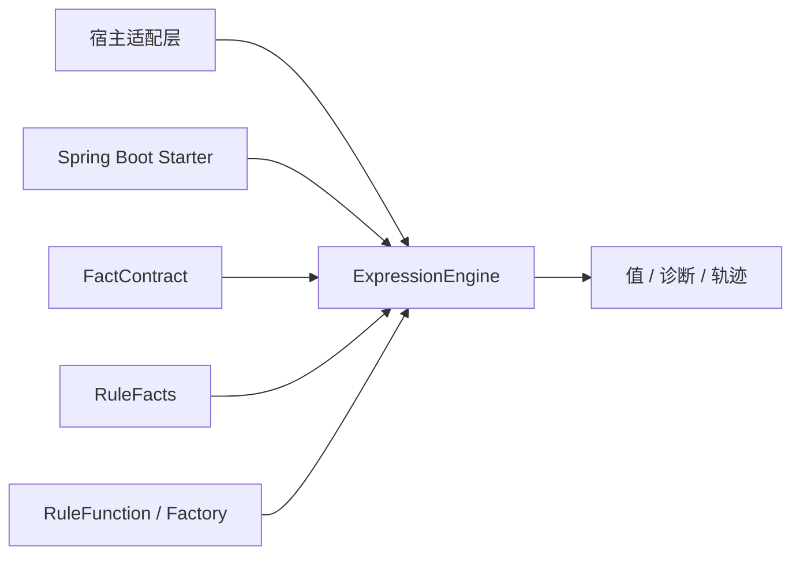

# 规则表达式内核架构

## 1. 架构定位

Letool 3.0 是强类型、无业务状态的单表达式内核。core 只依赖 `letool-exception-core`，不引用 Spring、数据库、缓存、脚本引擎或宿主业务类型。



规则发布、规则集选择、数据加载、动作执行和事务由宿主负责。EDC、保险或风控系统接入时只能从外向内依赖 Letool。

## 2. 唯一完整门面

`ExpressionEngine` 是唯一编译与求值门面：

```text
compile(CompilationRequest)
  -> 源码与限制校验
  -> Lexer
  -> Parser
  -> 类型与依赖分析
  -> CompiledExpression

evaluate(EvaluationRequest)
  -> 执行环境摘要校验
  -> 依赖事实与运行类型校验
  -> 合并引擎限制和单次限制
  -> 显式帧栈求值
  -> 结果类型校验
  -> ExpressionEvaluationResult
```

编译流水线、求值运行时、AST 和单次可变会话均为包内实现。3.0 不提供可分别替换的 Compiler/Evaluator SPI，也不允许构造“默认编译 + 第三方求值”这类语义不闭合的组合。

## 3. 执行模型与内容摘要

`ExecutionModelDescriptor` 冻结以下语义维度：

- 表达式语言版本；
- Letool 编译与求值的成套语义版本；
- 类型目录摘要；
- 函数目录摘要；
- 影响编译的选项摘要。

`environmentDigest()` 使用固定领域标识、UTF-8 长度前缀和 SHA-256 计算。任一维度变化都会形成新的环境摘要。它是缓存一致性身份，不是数字签名、加密或授权凭证。

`CompiledExpression.artifactDigest()` 还覆盖源码、规范 AST、结果类型、事实依赖、函数依赖、依赖覆盖状态、事实契约摘要和环境摘要。产物只能在相同环境摘要的引擎中求值，不承诺跨 Letool 大版本序列化兼容。

宿主缓存键至少应包含：

```text
业务规则编码 + 业务规则版本 + FactContract.contractDigest()
  + ExpressionEngine.executionModel().environmentDigest()
```

## 4. 依赖分析

编译产物保存类型化事实依赖和函数依赖：

- `DependencyCoverage.COMPLETE`：所有事实读取都能由静态依赖表达；
- `DependencyCoverage.DYNAMIC`：至少一个函数可能读取显式参数以外的事实。

`RuleFunction.factAccess()` 默认返回 `DYNAMIC_FACTS`。只有确认函数完全依赖显式参数时，才应声明 `EXPLICIT_ARGUMENTS_ONLY`。Letool 不猜测字符串参数是否代表字段路径；宿主做字段级增量筛选时，对动态依赖规则保守执行。

## 5. 类型和求值语义

编译阶段完成强类型检查。逻辑运算只接受布尔值；整数和小数使用 `BigInteger`、`BigDecimal` 精确域；只允许明确声明的整数到小数提升。字符串不会隐式转成数字、布尔或日期。

求值使用显式帧栈，`AND` 和 `OR` 在进入右子树前短路。每次调用创建独立会话，负责函数调用预算、轨迹和摘要，不跨请求共享业务状态。

## 6. 扩展边界

| 扩展点 | 用途 | 不允许 |
| --- | --- | --- |
| `FactContract` | 声明允许读取的路径和类型 | 动态数据库查询 |
| `RuleFacts` | 一次求值的不可变事实快照 | 回写宿主对象 |
| `RuleFunction` | 线程安全、受控的标量计算 | 隐藏业务动作 |
| `RuleFunctionFactory` | 创建调用级隔离函数 | 跨调用共享可变会话 |
| `EngineLimits` | 收紧资源预算 | 改变语言语义 |
| `ValueSummarizer` | 脱敏轨迹展示 | 改变求值结果 |
| `DiagnosticMessageResolver` | 本地化诊断 | 改变机器诊断码 |

LIKE、正则等通用能力可以用强类型函数提供；如果未来成为 Letool 标准能力，应作为经过版本化设计和测试的通用函数模块交付，不能夹带某个宿主的缺失值或状态语义。

## 7. 不可变与并发

`ExpressionEngine`、`CompiledExpression`、`FactContract`、`RuleFacts` 和结果对象均可并发读取。Builder 只在装配线程使用；`THREAD_SAFE` 函数会被共享，`INVOCATION_SCOPED` 函数由工厂按调用创建。

框架能验证函数声明和可观察返回值，不能证明宿主函数没有 IO 或副作用。因此函数注册属于受信任部署边界，仍需代码审查。

## 8. 失败模型

可恢复的规则错误通过结果对象返回：编译失败使用 `CompilationResult.diagnostics()`，求值失败使用 `ExpressionEvaluationResult.diagnostics()`。API 误用抛出 `RuleEngineException`。

执行环境不一致返回 `EXECUTION_ENVIRONMENT_MISMATCH`；事实缺失和类型漂移分别返回稳定诊断，不尝试业务兼容转换。
