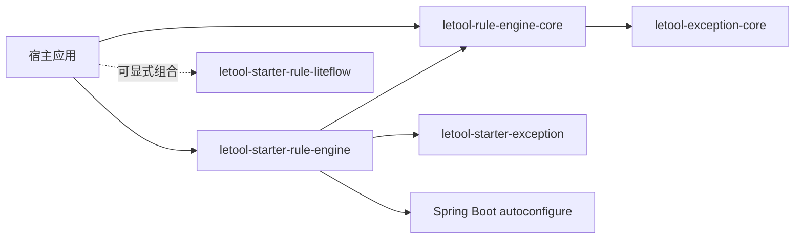
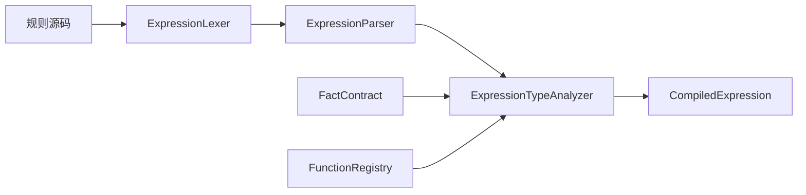
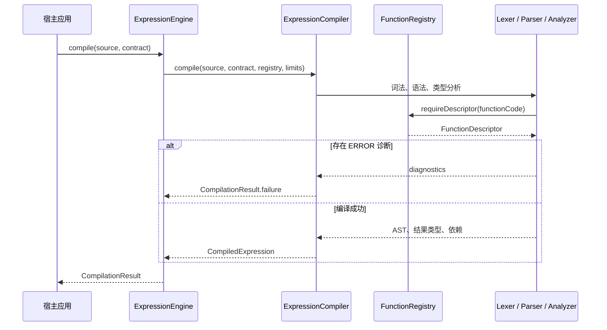
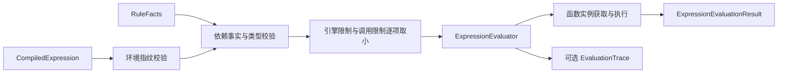
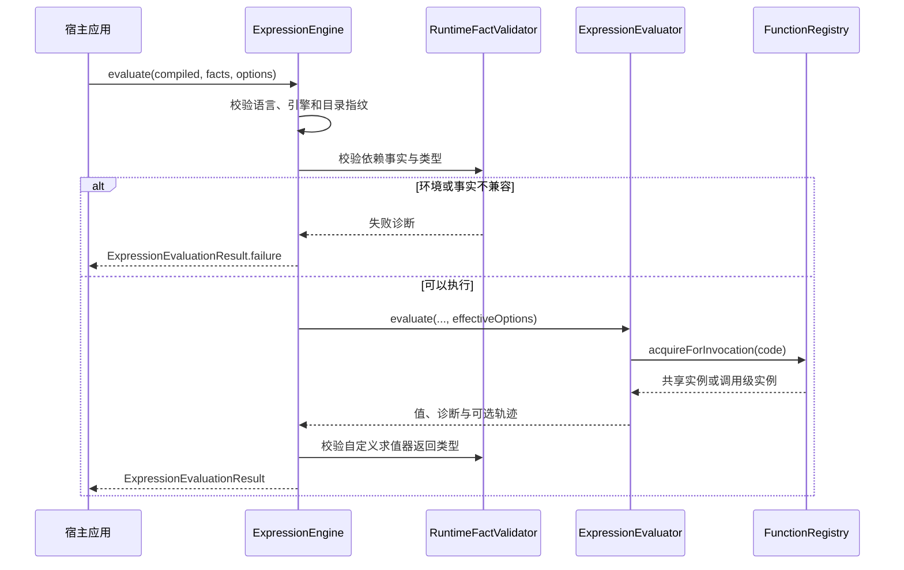
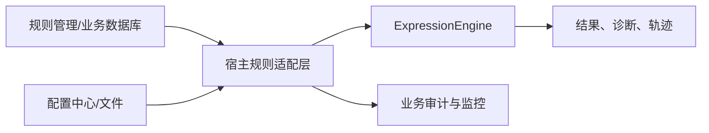

# 规则表达式内核架构

## 架构目标

框架围绕四个原则组织：core 保持纯 Java；规则在执行前完成类型检查；跨请求对象使用不可变快照；面对不可信源码、事实和扩展实现时默认受限失败。它是表达式执行内核，不接管规则发布、业务流程和数据持久化。

## 模块与依赖方向

`letool-rule-engine-core` 是纯 Java 执行内核，运行时只依赖 `letool-exception-core`。`letool-starter-rule-engine` 位于外层，依赖 core、`letool-starter-exception` 和 Spring Boot 自动配置 API。依赖方向不可反转，core 不能引用 Spring、Starter 或宿主业务类型。



通用规则引擎负责 DSL 表达式计算；`letool-starter-rule-liteflow` 负责 LiteFlow 规则链编排。两者互不替换、互不依赖。

## 核心包职责

| 包 | 主要职责 | 不负责 |
|----|----------|--------|
| `api` | 引擎门面、构建器和统一资源限制 | 业务规则来源与发布 |
| `expression` | 词法、语法和不可变 AST | 类型推断与事实读取 |
| `compile` | 编译流水线、依赖收集和编译产物 | 执行表达式 |
| `type` | 类型描述、事实契约和兼容矩阵 | Java 对象反射转换 |
| `fact` | 输入规范化、事实快照、路径解析 | 数据库或远程数据读取 |
| `function` | 函数签名、注册目录和生命周期 | 具体业务函数实现 |
| `evaluate` | 运行期校验、求值、轨迹和安全摘要 | 动作执行与流程编排 |
| `diagnostic` | 稳定诊断码、位置和消息格式化 | 日志落库与告警发送 |
| `exception` | API 误用与技术故障的稳定异常协议 | 业务异常体系 |

## 编译链



默认 `DefaultExpressionCompiler` 严格按资源检查、词法、语法、语义顺序执行。任何阶段失败都返回 `CompilationResult.failure`，不产生部分编译产物。成功产物包含：源码、规范 AST、结果类型、事实依赖、函数依赖，以及语言版本、引擎版本、类型目录、事实契约和函数目录指纹。

当前语言版本和默认引擎版本均为 `1.0`。`CompiledExpression.fingerprint()` 是覆盖源码、AST、类型、依赖和环境指纹的 SHA-256；它用于稳定识别编译语义，不是源码加密或访问控制凭证。

编译阶段的实际调用顺序如下。函数目录在这里仅提供描述信息，不创建调用级函数实例。



## 求值链



门面先核对函数目录、类型目录、引擎和语言版本，再只校验编译产物实际依赖的事实路径。默认求值器使用显式帧栈执行 AST，`AND`、`OR` 短路；函数调用、轨迹节点和摘要都受限制。自定义求值器仍要经过门面的指纹、事实和返回类型治理。



## 不可变快照与线程模型

- `ExpressionEngineBuilder`、`FactContract.Builder` 是单配置线程使用的可变构建器。
- 每次 `build()` 都冻结编译器、求值器、限制和函数目录，与构建器之后的修改隔离。
- `CompiledExpression`、`RuleFacts`、`FactContract`、函数目录及结果对象均不可变，可并发读取。
- 默认编译器和求值器无可变共享会话状态；同一默认引擎可并发调用。
- `THREAD_SAFE` 函数实例会被并发共享；`INVOCATION_SCOPED` 函数必须通过工厂为每次调用创建新实例。

线程安全结论只覆盖默认实现和满足契约的函数。通过 `compiler(...)`、`evaluator(...)` 注入自定义 SPI 后，宿主必须自行保证其并发安全、结果契约和资源治理；框架不能替第三方实现证明这些性质。

## 对象生命周期

| 对象 | 创建时机 | 推荐生命周期 | 并发约定 |
|------|----------|--------------|----------|
| `ExpressionEngineBuilder` | 应用装配期 | 单次配置 | 不并发修改 |
| `ExpressionEngine` | 应用启动或配置刷新 | 长期共享 | 默认实现可并发调用 |
| `FactContract` | 业务事实模型发布时 | 按契约版本共享 | 不可变 |
| `CompiledExpression` | 规则版本编译成功后 | 按规则版本共享 | 不可变 |
| `RuleFacts` | 每次业务请求或批次 | 单次求值 | 不可变，可安全传递 |
| `EvaluationOptions` | 每次求值 | 单次求值 | 不可变 |
| `RuleFunction` | 引擎构建或每次调用 | 取决于线程模型 | 必须兑现声明 |

编译产物可以由宿主缓存，但缓存键至少应包含规则版本、事实契约指纹和函数目录指纹。框架当前不提供缓存组件，也不会替宿主决定失效、租户隔离或发布回滚策略。

## 扩展点与责任

| 扩展点 | 适用场景 | 框架仍会校验 | 宿主必须保证 |
|--------|----------|--------------|--------------|
| `RuleFunction` | 无状态、线程安全计算 | 编码、签名、目录指纹、返回类型 | 并发安全和声明的副作用特征 |
| `RuleFunctionFactory` | 每次调用需要独立状态 | 描述信息、调用级实例一致性 | 创建成本和实例隔离 |
| `ExpressionCompiler` | 替换默认语言或编译策略 | 门面输入与技术异常净化 | 产物版本、依赖和指纹正确 |
| `ExpressionEvaluator` | 替换默认执行策略 | 指纹、事实依赖和最终返回类型 | 资源限制、线程安全和结果契约 |
| `DiagnosticMessageResolver` | 自定义展示语言 | 安全参数格式化边界 | 文案准确且不暴露敏感信息 |

## 失败模型

可恢复的规则错误使用结果对象：编译错误进入 `CompilationResult.diagnostics()`，运行期错误进入 `ExpressionEvaluationResult.diagnostics()`。空参数、无效构建器配置等 API 误用抛出 `RuleEngineException`。运行期失败可在 `failureCause()` 保留技术原因链，但原因消息不会自动进入诊断展示。

编译产物必须在兼容的函数目录、类型目录、语言和引擎环境中求值；不匹配返回 `FINGERPRINT_MISMATCH`。事实缺失或类型漂移分别返回稳定诊断，而不是尝试隐式转换。

## 数据来源与持久化边界

框架不建表，也不依赖 JDBC、JPA、MyBatis。规则可以来自任何来源，但加载、授权、版本发布、审核和持久化由宿主完成。业务层可以自行定义类似接口；下面的类型不属于 Letool 框架制品：

```java
package com.example.rules;

import java.util.Optional;

// 业务层接口示意，不属于 letool-rule-engine-core 或 Starter。
public interface RuleSourceRepository {
    Optional<String> findExpression(String ruleCode);
}
```

只有在多个独立宿主已经验证出相同的存储契约，并明确了租户、版本、并发发布、审计、回滚和失败语义后，才值得考虑独立的可选 repository 模块。即使新增，该模块也应保持从外向内依赖 core，不能把数据库依赖带入 core 或 Starter 基础路径。

典型部署中，规则管理服务或业务数据库只把规则源码和版本交给宿主应用；宿主在发布阶段编译并记录指纹，在请求阶段组装 `RuleFacts` 后调用引擎。引擎不主动联网，也不会反向访问规则管理服务。



## 当前范围

已实现的是以标量运算为核心的强类型单表达式：事实路径、受控函数、算术、比较、逻辑、`IN`、`BETWEEN` 和空值判断。事实与函数类型系统可以描述数组和对象，但未实现通用集合遍历、规则集、多规则聚合、动作计划、数据库持久化或编译缓存。后续能力必须以实际代码和版本文档为准，本文不构成路线图承诺。
