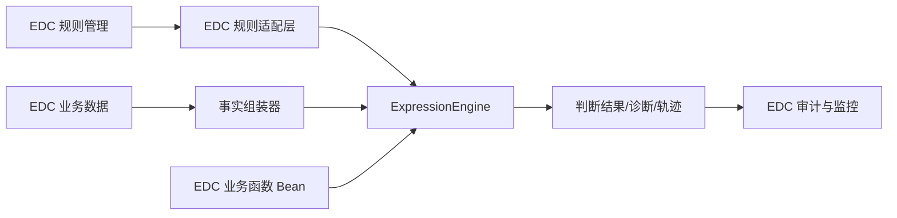
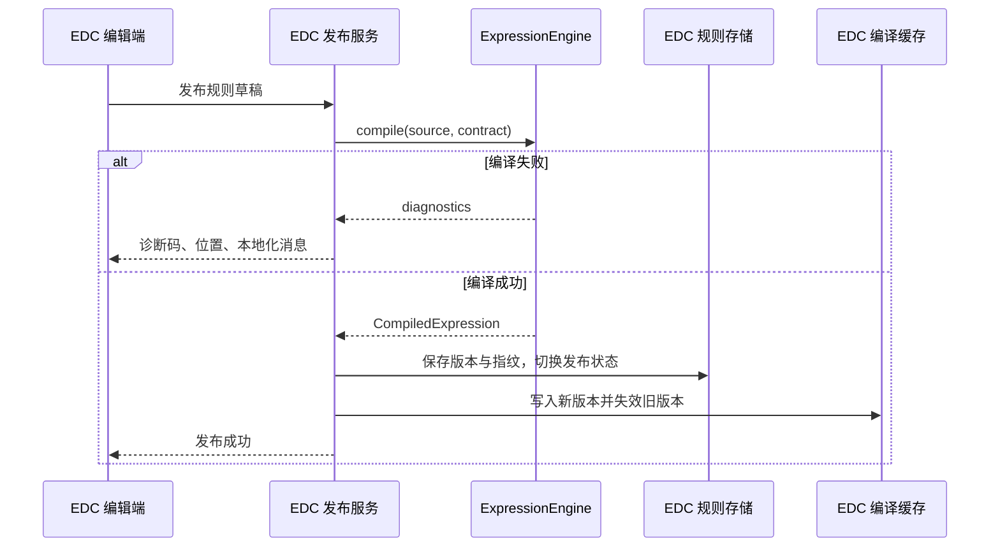

# EDC 规则引擎接入指南

本文说明 EDC 如何把现有规则管理与通用表达式引擎衔接起来。它描述的是适配边界和迁移步骤，不是 EDC 业务代码、数据库脚本或强制表结构。

## 1. 接入目标

EDC 继续管理规则的业务身份、版本和发布流程，Letool 负责把一条表达式编译成可安全复用的执行产物，并对一次事实快照求值。



接入后的核心原则是：EDC 调用框架，框架不反向依赖 EDC。

## 2. 职责边界

| EDC 负责 | Letool 规则引擎负责 |
|----------|--------------------|
| 规则编码、名称、租户和业务分类 | DSL 词法、语法和类型检查 |
| 草稿、审核、发布、停用和回滚 | 编译产物和语义指纹 |
| 规则源码与版本持久化 | 事实依赖与函数依赖提取 |
| 权限、审计和操作日志 | 有界事实规范化与表达式求值 |
| 从 EDC 数据组装事实 | 稳定诊断码、源码位置和安全轨迹 |
| 实现 EDC 业务函数 | 函数签名、线程模型和调用治理 |
| 缓存策略和监控接入 | 不可变对象与并发执行边界 |

框架不建表、不执行 DDL，也不依赖 JDBC、JPA 或 MyBatis。EDC 可以复用现有规则表；如果需要新增版本、指纹或发布状态字段，也由 EDC 按自己的数据模型设计。

## 3. 建议的 EDC 适配层

以下接口属于 EDC 示例，不是 Letool 公共 API。它们的作用是把规则来源、事实组装和引擎调用分开。

```java
package com.example.edc.rules;

import io.github.leylaragg.letool.ruleengine.type.FactContract;

import java.util.Map;
import java.util.Optional;

public interface EdcRuleSourceProvider {
    Optional<EdcRuleSource> findPublished(String ruleCode);
}

public record EdcRuleSource(
        String ruleCode,
        long version,
        String expression,
        String contractVersion) {
}

public interface EdcFactAssembler<C> {
    Map<String, Object> assemble(C context);
}

public interface EdcRuleContractProvider {
    FactContract require(String contractVersion);
}
```

`EdcRuleContext` 由 EDC 按实际执行场景定义。适配层还需要维护“规则业务版本对应哪个 `FactContract`”。契约可以由代码、配置或 EDC 元数据生成，但发布后的同一版本必须稳定。

## 4. Spring Boot 装配

EDC 引入 Starter 后直接注入 `ExpressionEngine`。无状态业务函数可以声明为 `RuleFunction` Bean；带调用状态的函数应通过 `RuleFunctionFactory` 提供。

```xml
<dependency>
    <groupId>io.github.leylaragg</groupId>
    <artifactId>letool-starter-rule-engine</artifactId>
    <version>2.0.0-beta.1</version>
</dependency>
```

```java
import io.github.leylaragg.letool.ruleengine.api.ExpressionEngine;
import io.github.leylaragg.letool.ruleengine.compile.CompiledExpression;
import io.github.leylaragg.letool.ruleengine.evaluate.EvaluationOptions;
import io.github.leylaragg.letool.ruleengine.fact.RuleFacts;
import io.github.leylaragg.letool.ruleengine.type.FactContract;
import org.springframework.stereotype.Service;

@Service
public final class EdcRuleExecutor {
    private final ExpressionEngine engine;
    private final EdcRuleSourceProvider sourceProvider;
    private final EdcFactAssembler<EdcRuleContext> factAssembler;
    private final EdcRuleContractProvider contractProvider;

    public EdcRuleExecutor(
            ExpressionEngine engine,
            EdcRuleSourceProvider sourceProvider,
            EdcFactAssembler<EdcRuleContext> factAssembler,
            EdcRuleContractProvider contractProvider) {
        this.engine = engine;
        this.sourceProvider = sourceProvider;
        this.factAssembler = factAssembler;
        this.contractProvider = contractProvider;
    }

    public boolean evaluate(String ruleCode, EdcRuleContext context) {
        EdcRuleSource source = sourceProvider.findPublished(ruleCode)
                .orElseThrow(() -> new IllegalArgumentException("规则未发布"));
        FactContract contract = contractProvider.require(source.contractVersion());
        CompiledExpression expression = engine
                .compile(source.expression(), contract)
                .requireCompiled();
        RuleFacts facts = RuleFacts.fromMap(factAssembler.assemble(context));
        return engine.evaluate(expression, facts, EvaluationOptions.defaults())
                .requireBoolean();
    }
}
```

示例为了展示调用链，在请求中直接编译。生产实现应在规则发布、首次加载或缓存未命中时编译，并复用 `CompiledExpression`。

## 5. 规则发布链路

建议把 EDC 发布流程拆成以下步骤：

1. 读取草稿表达式和目标事实契约。
2. 使用当前应用函数目录调用 `engine.compile`。
3. 有错误诊断时阻止发布，并把诊断码、位置和本地化消息返回编辑端。
4. 编译成功后记录规则版本、契约指纹和编译指纹。
5. 原子切换“已发布版本”，同时使旧缓存键失效。
6. 保留上一可用版本，以便业务回滚。



## 6. 编译缓存

EDC 可以定义业务缓存键，但不要只使用规则编码：

```java
public record EdcRuleCompilationKey(
        String ruleCode,
        long ruleVersion,
        String factContractFingerprint,
        String applicationRelease) {
}
```

`applicationRelease` 用来隔离函数目录或引擎版本变化。缓存值可以是当前进程中的 `CompiledExpression`，框架不承诺把它作为跨版本序列化协议。应用重启或升级后，从规则源码重新编译更稳妥。

## 7. 事实组装

事实组装器应把 EDC 实体转换成小而稳定的业务视图：

```java
Map<String, Object> facts = Map.of(
        "subject", Map.of(
                "age", subject.age(),
                "status", subject.status()),
        "visit", Map.of(
                "siteCode", visit.siteCode(),
                "visitDate", visit.visitDate()));
```

- 只提供规则契约需要的数据，避免把 JPA 实体或整个聚合根直接放入事实。
- 字段命名使用稳定业务语义，不跟随数据库列名随意变化。
- 可空字段要在 `FactContract` 中明确；`Map.of` 不允许空值，可空事实使用可接收 `null` 的普通 `Map`。
- 外部输入较大时，用 EDC 配置对应的 `EngineLimits` 创建 `RuleFacts`。
- 一次求值只读取快照，框架不会回写 EDC 对象。

## 8. 业务函数迁移

原 EDC 规则函数应先按用途分类：

| 类型 | 接入方式 | 说明 |
|------|----------|------|
| 纯计算、无状态 | `RuleFunction` | 可声明为 Spring Bean 并共享 |
| 每次调用需要独立状态 | `RuleFunctionFactory` | 每次调用创建实例 |
| 需要查询远程系统或写库 | 优先移到事实组装/业务流程 | 避免把不可控副作用藏进表达式 |
| 动作、通知、状态迁移 | EDC 流程或 LiteFlow | 不属于表达式求值职责 |

迁移时要为函数固定编码、参数类型、返回类型和语义版本。编码相同但语义变化时必须升级语义版本并重新编译规则。

## 9. 迁移步骤

### 第一步：盘点

列出现有规则语法、事实变量、函数、空值规则、时间语义和错误处理方式，标记与新 DSL 不同的部分。

### 第二步：建立契约

按 EDC 业务域建立 `FactContract`，先覆盖高频规则。契约版本应能独立于数据库版本演进。

### 第三步：迁移函数

先迁移确定性、无副作用函数；有外部调用的旧函数改为预取事实或保留在旧链路中，避免一次完成高风险重构。

### 第四步：离线编译

批量编译存量规则，输出无法迁移的语法、类型和未知函数清单。不要在生产请求中第一次发现这些问题。

### 第五步：双跑比对

同一份脱敏事实同时执行旧引擎和新引擎，只比较结果和稳定错误分类，不让新结果影响业务决策。重点覆盖：

- `null`、缺失路径和可空路径；
- 整数、小数除法及精度；
- 日期、日期时间、Instant 和时区；
- `IN`、`BETWEEN`、短路逻辑；
- 函数异常、资源超限和事实类型漂移。

### 第六步：灰度与回滚

按租户、站点、规则类型或流量比例灰度。每次决策记录使用的规则版本和编译指纹；出现差异时可以切回上一发布版本或旧引擎。

## 10. 兼容性注意事项

- 新引擎是强类型的，不会把字符串自动转换成数字、布尔或时间。
- 路径缺失与路径值为 `null` 是两种状态。
- 日期时间字面量和 Java 类型必须与 DSL 契约对应。
- 函数编码会规范化，重复编码在启动或构建引擎时失败。
- 编译产物只能在兼容的语言、引擎、类型目录、事实契约和函数目录中执行。
- 规则链、多个规则聚合、优先级和动作执行仍由 EDC 或 LiteFlow 处理。

## 11. 监控与审计字段

EDC 的规则决策日志建议记录：

| 字段 | 说明 |
|------|------|
| ruleCode / ruleVersion | 业务规则身份 |
| compiledFingerprint | 实际执行的编译语义 |
| contractVersion / fingerprint | 使用的事实契约 |
| resultCategory | 成功、编译失败或求值失败 |
| diagnosticCodes | 稳定机器码集合 |
| duration | 编译或求值耗时 |
| traceTruncated | 调试轨迹是否被预算截断 |

不要默认记录规则完整事实、患者敏感信息、函数异常原始消息或完整轨迹。需要定位问题时，应使用 EDC 自身的授权、脱敏和审计机制。

## 12. 上线检查清单

- [ ] 存量规则已完成离线编译和差异分类。
- [ ] EDC 事实契约、规则版本和函数语义版本有负责人。
- [ ] 发布失败能展示本地化诊断和精确源码位置。
- [ ] 编译缓存按版本和环境隔离，并能在发布时失效。
- [ ] 双跑覆盖空值、数值、时间、函数和资源限制边界。
- [ ] 灰度开关和上一版本回滚路径已演练。
- [ ] 决策日志不包含未脱敏事实和异常原始消息。
- [ ] 没有为了接入框架给 core 或 Starter 增加数据库依赖。

## 13. 延伸阅读

- [完整使用手册](user-guide.md)
- [架构](architecture.md)
- [DSL 参考](dsl-reference.md)
- [函数扩展](function-extension.md)
- [诊断与追踪](diagnostics-and-tracing.md)
- [Spring Boot 集成](spring-boot-integration.md)
