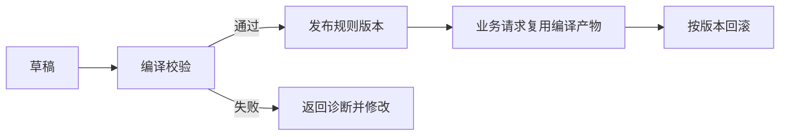

# 规则引擎完整使用手册

本文面向需要把表达式规则接入业务系统的开发者，按“定义契约、编译、发布、求值、观测”的顺序说明一条规则如何进入生产。DSL 细节、函数实现和 Spring 配置分别链接到专题文档，避免在这里重复整张参考表。

## 1. 选择接入方式

| 场景 | 依赖 | 说明 |
|------|------|------|
| 普通 Java、SDK 或非 Spring 服务 | `letool-rule-engine-core` | 手动构建 `ExpressionEngine`，依赖最少 |
| Spring Boot 应用 | `letool-starter-rule-engine` | 自动配置引擎、限制、函数 Bean 和国际化消息 |
| 规则链与动作编排 | `letool-starter-rule-liteflow` | 适合流程节点，不替代表达式引擎 |

规则引擎只负责无副作用的条件判断和值计算。规则来源、审批发布、数据库、缓存和业务动作由宿主系统负责。

## 2. 六个核心对象

| 对象 | 用途 | 推荐生命周期 |
|------|------|--------------|
| `ExpressionEngine` | 编译与求值的统一门面 | 应用级共享 |
| `FactContract` | 声明规则允许读取的路径和类型 | 按业务契约版本共享 |
| `CompilationResult` | 返回编译产物或结构化诊断 | 单次编译 |
| `CompiledExpression` | 已完成语法和类型校验的规则快照 | 按规则版本共享 |
| `RuleFacts` | 一次求值使用的不可变事实快照 | 单次请求或批次 |
| `EvaluationOptions` | Locale、时区、轨迹和单次资源限制 | 单次求值 |

这里最容易混淆的是 `FactContract` 和 `RuleFacts`：前者回答“规则可以依赖什么”，后者回答“这次请求实际提供了什么”。

## 3. 从零完成一次求值

下面的 Java 17 示例只使用公开 API，可放在普通 Java 应用中；Spring Boot 应用只需要把手动构建的引擎换成注入的 Bean。

```java
import io.github.leylaragg.letool.ruleengine.api.CompiledExpression;
import io.github.leylaragg.letool.ruleengine.api.ExpressionEngine;
import io.github.leylaragg.letool.ruleengine.compile.CompilationResult;
import io.github.leylaragg.letool.ruleengine.diagnostic.RuleDiagnostic;
import io.github.leylaragg.letool.ruleengine.evaluate.EvaluationOptions;
import io.github.leylaragg.letool.ruleengine.evaluate.ExpressionEvaluationResult;
import io.github.leylaragg.letool.ruleengine.fact.RuleFacts;
import io.github.leylaragg.letool.ruleengine.type.FactContract;
import io.github.leylaragg.letool.ruleengine.type.TypeDescriptor;
import io.github.leylaragg.letool.ruleengine.type.TypeKind;

import java.math.BigDecimal;
import java.util.Map;

ExpressionEngine engine = ExpressionEngine.builder().build();

FactContract contract = FactContract.builder("order-v1")
        .path("order.amount", TypeDescriptor.scalar(TypeKind.DECIMAL, false))
        .path("order.paid", TypeDescriptor.scalar(TypeKind.BOOLEAN, false))
        .build();

CompilationResult<CompiledExpression> compilation = engine.compile(
        "${order.amount} >= 100.00 AND ${order.paid}", contract);

if (!compilation.isSuccessful()) {
    for (RuleDiagnostic diagnostic : compilation.diagnostics()) {
        System.out.printf("%s [%d,%d)%n",
                diagnostic.code().code(),
                diagnostic.startPosition(),
                diagnostic.endPosition());
    }
    throw new IllegalStateException("规则未通过编译");
}

CompiledExpression expression = compilation.requireCompiled();
RuleFacts facts = RuleFacts.fromMap(Map.of(
        "order", Map.of(
                "amount", new BigDecimal("128.50"),
                "paid", true)));

ExpressionEvaluationResult evaluation = engine.evaluate(
        expression, facts, EvaluationOptions.defaults());

if (!evaluation.isSuccessful()) {
    throw evaluation.failureCause();
}

boolean accepted = evaluation.requireBoolean();
```

生产代码通常不直接抛 `IllegalStateException`，而是把诊断码、位置和本地化消息返回给规则编辑器或发布流程。诊断展示方式见[诊断与追踪](diagnostics-and-tracing.md)。

## 4. 设计事实契约

契约应围绕业务语义，而不是直接复制数据库表结构。例如规则只需要订单金额和支付状态，就不要暴露整张订单对象。

```java
FactContract contract = FactContract.builder("order-v2")
        .path("order.amount", TypeDescriptor.scalar(TypeKind.DECIMAL, false))
        .path("order.paidAt", TypeDescriptor.scalar(TypeKind.INSTANT, true))
        .path("customer.level", TypeDescriptor.scalar(TypeKind.STRING, false))
        .build();
```

- 路径必须明确注册，父路径与子路径不能同时注册。
- `nullable=true` 表示路径存在时允许值为 `null`，不等于路径可以缺失。
- 契约发生不兼容变化时应升级版本，并重新编译受影响规则。
- `contractDigest()` 覆盖版本、路径和类型，可用于缓存键和发布审计。

Java 类型映射、数组和路径限制见[事实与类型](facts-and-types.md)。

## 5. 编译、发布与回滚

推荐把编译放在规则保存校验或发布阶段，而不是每次业务请求中：



发布记录至少建议保存以下业务信息：

| 信息 | 用途 |
|------|------|
| 规则编码和业务版本 | 唯一定位可发布规则 |
| 表达式源码 | 审核、重编译和回滚 |
| 事实契约版本/摘要 | 判断事实模型是否兼容 |
| `CompiledExpression.artifactDigest()` | 审计本次编译语义 |
| 发布状态、发布人和时间 | 业务治理 |

`CompiledExpression` 不是数据库实体契约。跨部署保存 Java 对象会把序列化格式与实现细节绑定在一起，默认做法应是保存源码和版本，在发布或启动加载时用当前引擎重新编译。

## 6. 缓存建议

框架不内置缓存。宿主可以缓存不可变编译产物，缓存键至少包含：

```text
规则编码 + 规则版本 + 事实契约摘要 + 引擎环境摘要
```

缓存失效由业务规则发布系统负责。出现 `EXECUTION_ENVIRONMENT_MISMATCH` 时，不应跳过校验继续执行，而应使用当前引擎和契约重新编译。

## 7. 运行期事实与资源限制

如果输入来自请求、消息或数据库，应在转换为 `RuleFacts` 时就使用限制：

```java
RuleFacts facts = RuleFacts.fromMap(input, engineLimits);
```

这样深度、节点数和容器大小会在事实快照创建阶段受控。`EvaluationOptions` 还可以按单次请求收紧限制，但不能放宽引擎级限制。

事实对象会被规范化并防御性复制。不要把数据库连接、线程、输入流、反射对象或带行为的任意对象放入事实；支持类型以[事实与类型](facts-and-types.md)为准。

## 8. 轨迹、诊断与日志

轨迹默认关闭。排障或规则试运行时可以显式开启：

```java
EvaluationOptions options = EvaluationOptions.of(
        java.util.Locale.SIMPLIFIED_CHINESE,
        java.time.ZoneId.of("Asia/Shanghai"),
        true,
        engineLimits);

ExpressionEvaluationResult result = engine.evaluate(expression, facts, options);
result.trace().nodes().forEach(node -> System.out.println(node.summary()));
```

轨迹只保存有界安全摘要，仍不建议无条件写入生产日志。日志和指标优先记录规则编码、业务版本、产物摘要、诊断码、耗时和轨迹是否截断，不要记录完整事实或异常原始消息。

## 9. 并发与性能

- 共享同一个默认 `ExpressionEngine`，不要每次请求重新构建。
- 共享 `FactContract` 和 `CompiledExpression`，每次请求只创建 `RuleFacts` 与必要的选项。
- `THREAD_SAFE` 函数会被并发调用；带调用状态的函数使用 `RuleFunctionFactory`。
- 常规生产流量关闭轨迹，只在试运行、抽样或故障分析时开启。
- 在规则发布阶段编译，可以把词法、语法和类型错误挡在业务请求之外。

Letool 固定编译和求值流水线；宿主函数的并发安全仍取决于函数是否兑现声明的线程模型。

## 10. 监控建议

框架不绑定监控实现，宿主可围绕以下指标建设仪表盘：

| 指标 | 说明 |
|------|------|
| 规则编译成功率与耗时 | 观察发布质量和复杂规则 |
| 诊断码分布 | 区分语法、类型、事实和资源问题 |
| 求值次数、耗时和失败率 | 观察运行稳定性 |
| `EXECUTION_ENVIRONMENT_MISMATCH` 次数 | 发现缓存或部署版本漂移 |
| 轨迹截断次数 | 判断调试预算是否合适 |
| 业务函数耗时和失败率 | 由函数实现或外层拦截器采集 |

## 11. 生产检查清单

- [ ] 规则在发布前完成编译，失败诊断可返回编辑端。
- [ ] 事实契约有明确版本，变更时能定位受影响规则。
- [ ] 规则源码、版本、契约摘要和产物摘要可审计。
- [ ] 请求输入通过 `RuleFacts` 限制规范化，不传入危险对象。
- [ ] 函数线程模型与实现一致，函数编码和语义版本稳定。
- [ ] 生产默认关闭轨迹，日志不记录完整事实和敏感 cause。
- [ ] 缓存键包含规则、契约和函数环境维度，并支持发布失效。
- [ ] 已演练规则回滚、执行环境不匹配和函数故障。

## 12. 延伸阅读

- [架构](architecture.md)
- [DSL 参考](dsl-reference.md)
- [函数扩展](function-extension.md)
- [安全与限制](security-and-limits.md)
- [Spring Boot 集成](spring-boot-integration.md)
- [EDC 接入指南](edc-integration-guide.md)
