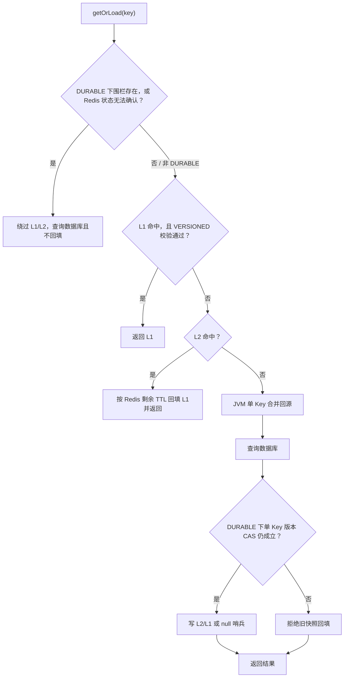
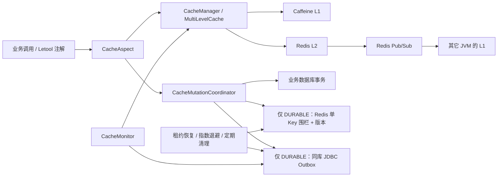
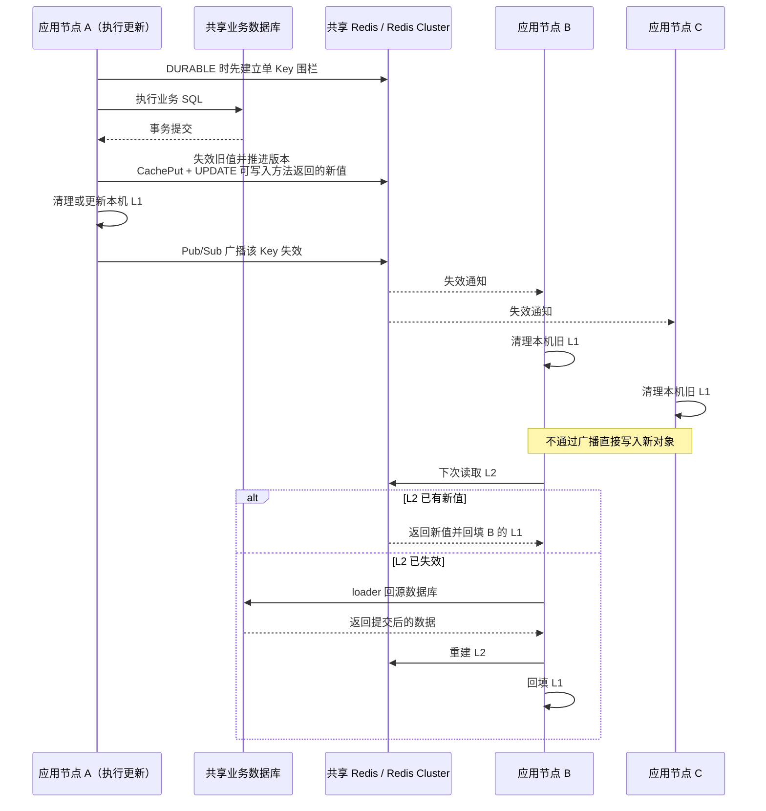
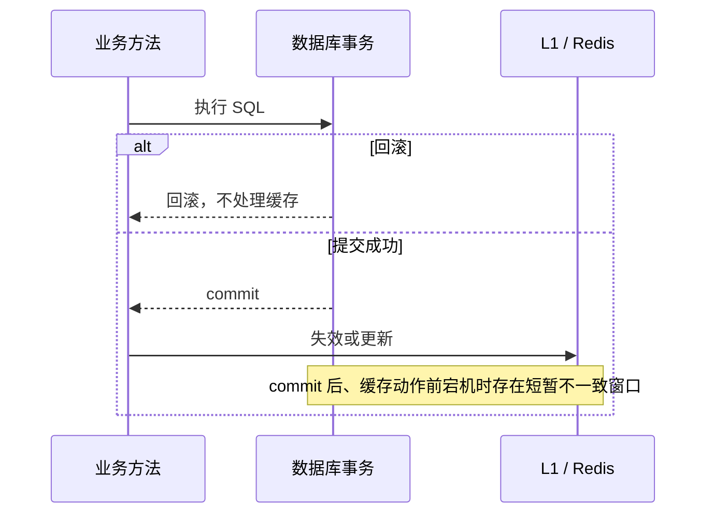
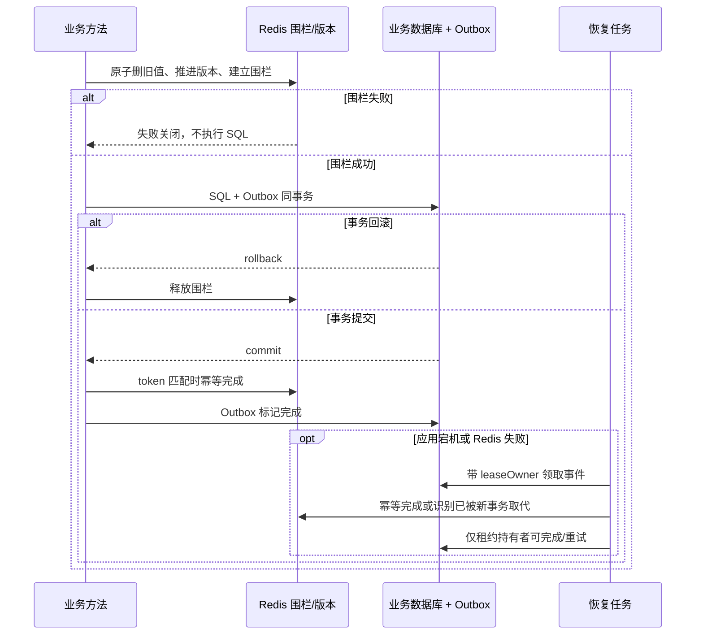

# letool-starter-cache

`letool-starter-cache` 是 letool 提供的二级缓存 starter，核心目标是给业务项目提供一套轻量、可控、可降级的缓存能力。

- L1 使用 Caffeine，本地进程内高速读取。
- L2 使用 Redis，多 JVM 共享缓存数据。
- 支持注解式和编程式两种接入方式。
- 支持事务提交后失效、版本化读取校验、跨 JVM L1 失效广播、Redis 异常降级和恢复探测。
- 支持 null 值哨兵，减少不存在数据反复穿透数据库。
- 支持 KV、List、Hash、Set、ZSet；集合缓存直接使用 Redis 原生数据结构。

## 适用场景

推荐使用：

- 读多写少的数据，例如用户详情、字典、配置、规则元数据。
- 多实例部署下需要 L1 本地加速，同时又希望 Redis 作为共享缓存。
- Redis 短暂异常时，业务更希望继续走本地缓存或回源，而不是被缓存层拖死。
- 需要对 null 结果做短 TTL 缓存，防止缓存穿透。

谨慎使用：

- 金融扣款、库存扣减等事实数据；数据库事务和条件更新必须承担最终裁决，缓存不能作为账本。
- 值非常大或 key 数量不可控的缓存区域。
- 写入极高频且要求每次读取都绝对实时的场景。

## Maven 引入

```xml
<dependency>
    <groupId>io.github.leylaragg</groupId>
    <artifactId>letool-starter-cache</artifactId>
    <version>${letool.version}</version>
</dependency>
```

如果项目需要 L2 Redis，请确保业务工程已经引入并配置 `spring-boot-starter-data-redis`。
Letool Tool 会在 Boot 创建连接工厂和对象模板后注册 `RedisUtil`，Cache 随后注册 L2 与失效广播组件；
业务自定义的 `redisTemplate` 保持优先，框架不会覆盖或改写其序列化器。
`spring-tx` 由本 starter 提供，用于提交后缓存动作；`spring-jdbc` 仍是可选依赖，只有使用默认
JDBC Outbox 时业务工程才需要提供它和业务 `JdbcTemplate`。

## 快速开始

### 1. 通过配置预注册缓存

```yaml
letool:
  cache:
    enabled: true
    redis-prefix: "myapp:cache:"
    l1-enabled: true
    l2-enabled: true
    consistency:
      mode: TRANSACTIONAL
      read-validation: VERSIONED
      write-policy: INVALIDATE
      # Redis 读取失败时默认返回完整的旧 L1 快照；规则索引等关键缓存应改为 FAIL_CLOSED
      read-failure-policy: STALE_IF_AVAILABLE
      # DURABLE 模式使用；表需要由业务项目按下文 SQL 预先创建
      outbox-table: letool_cache_outbox
      fence-ttl: 2m
      recovery-interval: 5s
      recovery-batch-size: 100
      recovery-lease: 30s
      retry-base-delay: 1s
      # 启用 L2 且 read-validation=VERSIONED 时，必须不小于
      # l1-ttl + max(fence-ttl, recovery-interval) + 10m
      version-metadata-retention: 7d
      completed-retention: 7d
      cleanup-interval: 1h
      cleanup-batch-size: 1000
    instances:
      - name: userCache
        l1-max-size: 2000
        l1-ttl: 30m
        l2-ttl: 2h
        redis-batch-size: 256
        # 可按缓存实例覆盖全局策略；未配置时继承全局值
        read-validation: VERSIONED
        write-policy: INVALIDATE
        read-failure-policy: FAIL_CLOSED
        null-value-cache: true
        null-value-ttl: 3m
    invalidation:
      enabled: true
      channel: "myapp:cache:invalidation"
    degradation:
      recovery-enabled: true
      recovery-interval: 30s
    annotation:
      enabled: true
    monitoring:
      enabled: true
```

单缓存未显式设置 Redis 前缀时继承 `letool.cache.redis-prefix`；Java 配置显式调用
`redisKeyPrefix(...)` 时优先使用该值。

### 2. 使用注解读取缓存

```java
@MultiLevelCacheable(name = "userCache", key = "#userId", ttl = 1800)
public User getUser(Long userId) {
    return userMapper.selectById(userId);
}
```

说明：

- `name` 必须对应一个已经注册的缓存实例。
- `key` 支持 SpEL，例如 `#userId`、`#request.userId`。
- `ttl` 单位是秒；不设置或设置为 `0` 时使用缓存实例默认 L2 TTL。
- 业务方法抛出的异常会原样抛回，不会因为接入缓存注解而改变异常类型。

### 3. 更新或清理缓存

```java
@MultiLevelCachePut(name = "userCache", key = "#user.id", ttl = 1800)
public User updateUser(User user) {
    userMapper.updateById(user);
    return user;
}

@MultiLevelCacheEvict(name = "userCache", key = "#userId")
public void deleteUser(Long userId) {
    userMapper.deleteById(userId);
}
```

默认 `write-policy=INVALIDATE`，因此 `@MultiLevelCachePut` 在数据库事务提交后删除旧缓存，
下一次读取再从数据库重建。只有确认方法返回值就是数据库最终状态时，才配置
`write-policy=UPDATE` 让该注解在提交后写回返回值。

如果应用存在 Spring `PlatformTransactionManager`，Put/Evict 注解会加入当前事务或创建
`REQUIRED` 事务；数据库回滚时不执行缓存动作。没有事务管理器时，框架只能在业务方法
成功返回后立即处理缓存，不具备数据库事务同步语义。

### 4. 编程式使用

```java
@Configuration
public class CacheConfiguration {

    @Bean
    public MultiLevelCache<String, User> userCache(CacheManager cacheManager) {
        CacheConfig<String, User> config = CacheConfig.<String, User>builder("userCache")
                .l1MaxSize(2000)
                .l1Ttl(Duration.ofMinutes(30))
                .l2Ttl(Duration.ofHours(2))
                .consistencyMode(CacheConsistencyMode.TRANSACTIONAL)
                .readValidation(CacheReadValidation.VERSIONED)
                .writePolicy(CacheWritePolicy.INVALIDATE)
                .nullValueCache(true)
                .nullValueTtl(Duration.ofMinutes(3))
                .redisKeyPrefix("myapp:cache:")
                .build();
        return cacheManager.getOrCreate(config);
    }
}
```

```java
User user = userCache.getOrLoad("user:1001", key -> userMapper.selectById(1001L));
userCache.put("user:1001", user, Duration.ofMinutes(20));
userCache.evict("user:1001");
CacheStats stats = userCache.stats();
```

## 读取流程



## 总体架构



### 应用集群中的写入传播

应用部署多个 JVM 实例时，每个实例拥有独立的 Caffeine L1，Redis L2 和业务数据库由所有实例共享。
一个节点完成更新后，其它节点收到的是“失效通知”，不会直接把广播消息当成新值写入 L1：



这套传播由两层机制共同保证：

- Redis Pub/Sub 负责快速通知在线节点清理 L1，降低旧值继续存在的时间。
- `read-validation=VERSIONED` 负责兜底。节点离线、网络抖动或重启期间即使错过 Pub/Sub，下一次读取
  也会校验 Redis 单 Key 版本，版本不一致时拒绝旧 L1。

业务没有提供 `RedisMessageListenerContainer` 时，Letool 会创建名为
`letoolCacheInvalidationListenerContainer` 的默认容器；业务只有一个默认监听容器时，Letool 直接复用
该容器并自动注册失效通道订阅，不会增加同类型 Bean，也不会破坏业务原有的按类型注入。业务提供同名
容器表示完全接管，接管方必须自行注册 Letool 失效监听器；不需要跨 JVM 失效时，也可以设置
`letool.cache.invalidation.enabled=false`，同时关闭失效广播、自动订阅注册和默认监听容器。

`@MultiLevelCacheEvict` 无论写策略如何都只负责失效；只有 `@MultiLevelCachePut` 配合
`write-policy=UPDATE`，才会把方法返回值写入节点 A 的 L1 和共享 L2。DURABLE Outbox 只持久化并重放
“缓存失效完成”事件，不保存或重放业务对象；提交后应用宕机时，缓存值仍由后续读取按数据库结果重建。

因此，“其它节点都会更新”更准确的含义是：收到 Pub/Sub 通知的在线节点会清除旧 L1，并在下一次读取
时从共享 Redis 或数据库按需重建最新值。漏掉通知的节点只有启用 `VERSIONED` 时，才能在下次读取拒绝
旧 L1；配置为 `NONE` 时不具备该兜底。框架没有采用广播完整业务对象的方案，避免大对象传输、
序列化兼容和消息乱序把旧对象重新写回其它节点。

这里要区分两种集群，它们可以同时存在：

- 应用集群：多个 JVM 实例共享 Redis 和数据库，通过 Pub/Sub、版本校验和 Outbox 租约协作。
- Redis Cluster：Redis 数据分布在多个主节点；框架利用 Hash Tag 保证同一业务 Key 的数据、版本、
  围栏和幂等标记处于同一 Slot，避免 Lua 执行出现 `CROSSSLOT`。

上述保证的前提是数据库修改经过 Letool Put/Evict 注解或 `CacheMutationCoordinator`。绕过框架直接执行
Mapper、MyBatis-Plus 或外部 SQL 时，框架无法感知变化，业务方必须显式失效缓存。

框架只协调经过 `CacheAspect`/`CacheMutationCoordinator` 的修改。MyBatis-Plus、Mapper、Repository
本身不可能被框架自动识别；这些写入口应改为 Letool 注解/一致性执行器，或者在写成功后显式失效缓存。

MyBatis-Plus 推荐把注解放在执行 SQL 的 Service 方法上，让缓存切面包住完整写操作：

```java
@MultiLevelCacheEvict(name = "userCache", key = "#user.id")
public boolean saveOrUpdateUser(User user) {
    return userService.saveOrUpdate(user);
}
```

该示例要求 `user.id` 在进入方法前已经确定，适合更新或业务侧生成 ID。数据库/MP 在插入时生成 ID 的
新增方法不能使用进入方法前为空的表达式；应把新增和更新拆开，并在新增提交后用已生成 ID 显式
失效/建立缓存，或使用业务侧预生成的稳定 ID。

默认 `INVALIDATE` 下也可以使用 `@MultiLevelCachePut`，但它仍然执行“提交后失效”，不是强制写回；
纯清理场景优先用 `@MultiLevelCacheEvict`。需要编程式协调时，应显式注入
`CacheMutationCoordinator`，并把完整 SQL 动作交给其 `execute` 方法。

## 一致性模式与选择

缓存一致性不是越强越好。选择标准是：一次旧读是否会造成越权、错误放行或不可逆业务后果。

| 数据与后果 | 建议 |
| --- | --- |
| 用户昵称、头像、商品介绍、普通列表、统计和推荐结果 | 最终一致性，使用 `TRANSACTIONAL` |
| 可重试、可补偿且没有不可逆后果的业务状态展示 | `TRANSACTIONAL` |
| 权限撤销、账户禁用、风控名单、关键规则和紧急开关 | 使用 `DURABLE`，并先完成真实 Redis/数据库故障演练 |
| 余额、库存扣减、支付裁决、唯一性和幂等事实 | 由数据库事务、条件更新和约束保证；缓存不作最终裁决 |

### TRANSACTIONAL：事务最终一致性

这是默认且已经可用的模式：

1. 执行业务数据库事务。
2. 数据库提交后执行缓存失效或显式更新。
3. 数据库回滚时不改变缓存。

该模式成本较低，适合绝大多数企业缓存。但它不能覆盖“数据库刚提交、应用在缓存失效前立即宕机”
的极短窗口，因此不能称为严格强一致。



### DURABLE：持久化强一致

实现协议为“Redis 写入围栏 + 同事务 JDBC Outbox + 幂等清理 + 后台重放”：

1. 在业务 SQL 前原子删除旧 Redis 数据、推进单 Key 版本并建立有限 TTL 围栏；围栏失败则不执行 SQL。
2. 业务 SQL 与 Outbox 事件使用同一个 `PlatformTransactionManager` 提交或回滚。
3. 提交后幂等完成 Redis 清理并解除围栏；这一步失败时数据库事件保持未完成。
4. 后台恢复任务带租约领取事件并指数退避重试，应用重启后仍可继续。
5. 围栏存在或 Redis 状态无法确认时，读取绕过 L1/L2 直接查询数据库且不回填缓存。
6. 回源写缓存采用单 Key 版本 CAS，拒绝把并发事务提交前读到的旧数据库快照写回。



`fence-ttl` 必须大于业务事务允许的最大执行时间并留出网络抖动余量；过短会让仍在执行的超长事务
提前失去围栏，过长则会延长异常进程留下围栏时的数据库直读时间。生产上应让数据库事务超时先于
围栏超时，并监控 Outbox 待处理数量与最老事件年龄。

启用 `DURABLE` 必须同时具备 Redis、`CacheMutationCoordinator` 和 `CacheInvalidationEventStore`；缺少任一项
都会启动失败。默认会在存在业务 `JdbcTemplate` 时创建 `JdbcCacheInvalidationEventStore`，其表结构见
制品中的 `letool-cache-outbox-schema.sql`。框架不会自动执行 DDL，生产项目应通过 Flyway/Liquibase
或既有数据库变更流程建表。`DURABLE` 当前仅覆盖注解式 KV Put/Evict，不覆盖 List/Hash/Set/ZSet。
它也不把 `evictAll` 定义为可与任意并发写原子串行化的全区事务；关键数据应使用可定位的单 Key 失效。

同一 Spring 事务内多次修改同一缓存区域、同一序列化 key 时，框架复用一次围栏和一条 Outbox，
并在提交后依次执行全部缓存动作，避免嵌套 Service 调用互相争抢围栏。多数据源项目必须显式声明
绑定正确 `PlatformTransactionManager` 的 `CacheMutationCoordinator`，并显式声明使用同一业务库的
`CacheInvalidationEventStore`；框架不会按名称或主库约定猜测。

默认 JDBC Store 只在容器中有唯一 `JdbcTemplate` 候选时创建。多数据源项目可显式绑定：

```java
@Bean
CacheInvalidationEventStore userCacheEventStore(
        @Qualifier("userJdbcTemplate") JdbcTemplate jdbcTemplate) {
    return new JdbcCacheInvalidationEventStore(jdbcTemplate, "letool_cache_outbox");
}

@Bean
CacheMutationCoordinator userCacheMutationCoordinator(
        @Qualifier("userTransactionManager") PlatformTransactionManager transactionManager,
        RedisCacheFenceStore fenceStore,
        CacheInvalidationEventStore userCacheEventStore) {
    return new SpringCacheMutationCoordinator(
            transactionManager, fenceStore, userCacheEventStore);
}
```

自动配置会在业务已提供这些接口 Bean 时退让。当前默认 `CacheAspect` 只接受唯一协调器；如果同一应用的
不同缓存要分别写入不同数据库，必须提供自定义路由协调器和配套事件仓储，按缓存名称选择事务管理器，
不能直接注册多个协调器让框架猜测。默认后台恢复器同样只对应一个 Store；多缓存业务库还必须由业务
分别创建每个 Store 的 `CacheInvalidationRecovery`、调度器和监控聚合。这不是开箱即用场景，建议优先
按服务/数据库边界拆分应用，确需单应用多库时再实现完整路由与恢复链路。

Outbox 采用 `leaseOwner` 防止过期工作节点覆盖新租约结果；已完成事件默认保留 7 天，再按批量定期清理。
这里的 `leaseOwner` 实际保存“恢复实例 ID + 每次领取 UUID”的唯一租约令牌；即使同一实例租约过期后
重新领取，旧任务也不能覆盖新任务状态。
可通过 `cacheMonitor.outboxBacklog(Instant.now())` 获取 `pendingCount`、`processingCount`、
`completedCount` 和 `oldestOutstandingCreatedAt`，生产应对未完成数量及最老积压年龄设置告警。
表结构脚本位于 `classpath:/letool-cache-outbox-schema.sql`，其中包含领取扫描索引，应纳入业务项目的
Flyway/Liquibase 变更。框架持续重试而不自动丢弃永久失败事件，当前没有最大重试或人工跳过 API；
生产应同时监控恢复线程、重试次数和积压年龄，修复 Redis/数据库问题后让事件继续幂等重放，
不要直接把未完成事件改成 `COMPLETED`。
其中框架 API 目前只直接提供状态数量和最老积压时间；恢复线程存活、`attempt_count` 分布及调度异常
需要业务通过健康检查、日志告警或对 Outbox 表的只读 SQL 自建监控。

### 读取校验与数据库一致性是两件事

框架同时使用两种机制减少多 JVM L1 旧值问题：

- Redis Pub/Sub 失效广播：某个 JVM 执行 `put`、`evict`、`evictAll` 后，会通知其他 JVM 清理对应 L1。
- Redis 版本校验：`read-validation=VERSIONED` 时，每个业务 Key 维护独立 Redis 版本号，只有本地版本和 Redis 当前版本一致时才返回 L1。

生产建议：

- 多实例部署并且缓存数据会被多个实例写入时，建议保持 `read-validation=VERSIONED`。
- Pub/Sub 是瞬时消息，实例离线期间可能错过失效广播；关键缓存不要只依赖广播，应开启强一致版本校验。
- 失效消息使用框架私有的版本化 UTF-8 Wire Protocol，与业务 `RedisTemplate` 的值序列化器隔离；
  Fastjson2 或自定义对象序列化器不会改变消息字节。未知协议版本会被拒绝，旧格式只保留读取兼容。
- 对性能敏感且短时间旧值可以接受的缓存，可以把单个实例的 `read-validation` 设置为 `NONE`。
- 旧 `strong-consistency` 配置只作为读取校验兼容项保留，不会开启 `DURABLE`。

一致性责任边界：只有通过 Letool Put/Evict 注解或后续一致性执行器包裹的数据库修改，框架才能协调
事务和缓存。外部 SQL、直接调用 MyBatis-Plus `saveOrUpdate`、Mapper 或 Repository 而没有接入
Letool 一致性入口时，业务方仍须主动失效缓存。外层事务已经先执行 SQL、之后才调用缓存 API 也
不在自动保证范围内。

### 业务 Key 序列化契约

Redis 数据 key、版本 key、围栏、Outbox 和跨 JVM 失效广播必须使用完全相同的字符串。String、Long
等简单 key 可使用默认规则；复合对象 key 必须在 `CacheConfig` 中配置稳定且无歧义的序列化器：

```java
CacheConfig<UserTenantKey, User> config = CacheConfig.<UserTenantKey, User>builder("tenantUser")
        .keySerializer(key -> key.tenantId().length() + ":" + key.tenantId() + key.userId())
        .build();
```

上例用租户字符串长度标识第一个字段边界，并假定 `userId` 是固定语义的数值类型。序列化结果必须
跨 JVM、跨版本保持稳定；字段边界可能歧义时应使用转义、长度前缀或稳定 JSON。
更改已上线缓存的序列化规则等价于 Redis key 迁移，需要同步清理旧 key。

YAML 预注册目前只支持默认 key 规则；复合对象 key 应在 Java 中构建 `CacheConfig`，调用
`cacheManager.getOrCreate(config)` 并把返回的 `MultiLevelCache` 注册为 Bean。VERSIONED /
DURABLE 下主要 Redis key 形态如下，其中 Hash Tag 经过框架转义并保证同一业务 key 落在同一 Slot：

```text
数据：<prefix><encoded-cache-name>:{<business-key-sha256-prefix>}:<business-key>
版本：<prefix>%META%:<encoded-cache-name>:{<business-key-sha256-prefix>}:version
围栏：<prefix>%META%:<encoded-cache-name>:{<business-key-sha256-prefix>}:fence
区域纪元：<prefix>%META%:<encoded-cache-name>:region-version
```

`business-key-sha256-prefix` 是序列化 key 的 UTF-8 字节做 SHA-256 后取前 12 字节的十六进制摘要。

## Redis 降级和恢复

当 Redis 访问异常时，缓存实例会进入 L2 降级状态：

- 后续读写会跳过 Redis，避免每个请求都阻塞在 Redis 异常上。
- `read-validation=NONE` 时已有 L1 数据仍可命中。
- `read-validation=VERSIONED` 时无法验证 Redis 版本会丢弃并停止建立 L1，直接执行 loader 回源。
- 未命中时会继续执行 loader 回源。
- 上述“跳过 Redis 继续业务”只适用于缓存读和普通缓存操作；DURABLE 数据库修改必须先建立围栏，
  Redis 不可确认时失败关闭，绝不会跳过围栏继续执行 SQL。
- `CacheRecoveryScheduler` 会按 `recovery-interval` 定期尝试恢复 L2。
- List、Hash、Set、ZSet 恢复成功后会清空降级期间形成的本地快照，下一次读取重新以 Redis 为准。

生产建议：

- 降级期间命中率可能下降，要关注 `l2DegradedCount` 和业务回源压力。
- 如果缓存回源会打到数据库，请确保数据库侧有保护措施，例如限流、超时和熔断。

### Set 读取故障策略

`MultiLevelSetCache` 使用 `CacheReadFailurePolicy` 区分 Redis 权威空集合和故障结果：

| 策略 | 行为 |
| --- | --- |
| `STALE_IF_AVAILABLE` | 默认值；存在完整 L1 快照时返回旧快照，否则返回带失败状态的空结果 |
| `FAIL_CLOSED` | 抛出 `CACHE_006`，适用于规则索引、权限等不能把故障当空集合的场景 |
| `EMPTY_ON_FAILURE` | 明确接受故障时返回空结果，只用于允许假阴性的非关键场景 |

需要判断结果来源时调用 `getMembersWithStatus`；`getMembers` 保持旧 API，并返回可修改的成员快照。

## KV 批量访问与泛型值

`MultiLevelCache#getAllPresent`、`putAll(Map)` 和 `putAll(Map, Duration)` 使用有界 Redis
Pipeline，默认每 256 个业务 Key 一个批次。空 Map 无操作，null Key 被忽略，null Value 继续遵循
空值哨兵配置。强一致批量写仍按业务 Key 执行独立同槽 Lua，因此单 Key 原子，但不保证整批跨 Key 原子。

泛型值使用 `java.lang.reflect.Type` 描述；Jackson 序列化器可在应用重启后恢复集合元素类型：

```java
Type ruleListType = new TypeReference<List<RuleDto>>() { }.getType();
CacheConfig<String, List<RuleDto>> config = CacheConfig
        .<String, List<RuleDto>>builder("rules")
        .valueType(ruleListType)
        .build();
```

框架不新增 Java `ServiceLoader` SPI。现有 `CacheSerializer` 继续作为序列化扩展点，并增加
`deserialize(String, Type)`；失效协议、前缀扫描、版本治理和读取故障策略保持框架内部实现。
自定义序列化器如果仍只实现 `deserialize(String, Class)`，就不具备恢复参数化 `Type` 的 SPI 能力；
读取这类缓存时会直接抛出 `CACHE_007`。该错误表示序列化器能力与缓存声明不匹配，不属于 Redis
运行故障，也不会触发 L2 降级。

## Redis 原生集合缓存

List、Hash、Set、ZSet 缓存保留在本模块中，它们是 Redis 原生数据结构的轻量适配，不会把整个集合序列化为一个 JSON value：

- `MultiLevelListCache`：队列、时间线、有序事件。
- `MultiLevelHashCache`：用户资料字段、配置字段。
- `MultiLevelSetCache`：规则索引、标签索引、ID 集合。
- `MultiLevelZSetCache`：排行榜、权重或优先级排序。

五种缓存都按缓存名称隔离键空间。KV 在 `VERSIONED`/`DURABLE` 下额外使用单业务 Key 的 Redis Cluster
Hash Tag，使数据、版本和围栏 Key 落在同一 Slot；集合缓存继续使用普通区域前缀：

```text
<redis-key-prefix><encoded-cache-name>:<business-key>
```

例如全局前缀为 `myapp:cache:`、缓存名称为 `ruleIndex`、业务 Key 为 `product:loan` 时，
最终 Redis Key 为 `myapp:cache:ruleIndex:product:loan`。

缓存名称中的 `%` 和 `:` 会分别编码为 `%25` 和 `%3A`，确保缓存名称与业务 Key 的边界不会产生
歧义。例如缓存名称 `rule:index` 会使用 `rule%3Aindex` 作为 Redis Key 段。业务 Key 保持用户
序列化函数返回的原始形式，不由框架二次编码。

Set 示例：

```java
CacheConfig<String, Long> config = CacheConfig.<String, Long>builder("ruleIndex")
        .l1Ttl(Duration.ofMinutes(10))
        .l2Ttl(Duration.ofHours(1))
        .valueType(Long.class)
        .build();

MultiLevelSetCache<String, Long> ruleIndex = cacheManager.getOrCreateSetCache(config);
ruleIndex.add("product:loan", 1001L);
Set<Long> ruleIds = ruleIndex.getMembers("product:loan");
ruleIndex.remove("product:loan", 1001L);
```

其它结构的创建入口：

```java
MultiLevelListCache<String, Event> events =
        cacheManager.getOrCreateListCache(listConfig);

MultiLevelHashCache<String, String, String> profile =
        cacheManager.getOrCreateHashCache(
                hashConfig,
                Function.identity(),
                String.class,
                String.class
        );

MultiLevelZSetCache<String, String> ranking =
        cacheManager.getOrCreateZSetCache(zSetConfig);
```

KV、List、Hash、Set、ZSet 均支持清理整个缓存区域：

```java
userCache.evictAll();
events.evictAll();
profile.evictAll();
ruleIndex.evictAll();
ranking.evictAll();
```

Set 还支持按稳定业务 Key 序列化前缀清理：

```java
ruleIndex.evictByPrefix("project:");
```

该操作先清理本机匹配的 L1，再用转义后的 `SCAN + UNLINK` 删除 Redis Key，最后广播一条
PREFIX 消息清理其它节点的 L1。空前缀会快速失败；清理整个区域应使用 `evictAll()`。

区域清理使用 `SCAN + UNLINK` 分批处理，只扫描当前缓存名称对应的键空间，不调用会阻塞 Redis
主线程的 `KEYS`。Redis Cluster 模式会在扫描前校验主节点状态及 16384 个 Slot 的完整、无冲突覆盖，
并用应用当前客户端连接逐个 PING 主节点。拓扑或客户端可达性预检可以降低部分清理风险，但不能消除
预检后的拓扑变化和 SCAN 期间故障；此时方法会失败、标记 L2 降级且不广播全区域失效，调用方应重试
或告警。该能力要求 Redis 4.0 或更高版本，并要求缓存使用的 RedisTemplate 将
`StringRedisSerializer` 配置为 Key 序列化器；letool 提供的默认 RedisTemplate 已满足该约束。

类型解析顺序为：工厂方法显式类型、`CacheConfig.valueType(...)`、RedisTemplate 实际反序列化类型。本模块不再假设 Set 成员一定是 `Long`；生产配置建议显式声明类型。

集合缓存的一致性约束：

- Redis 健康时，一次 `add`、`put`、`push` 只更新已有的完整 L1 快照，不会凭局部写入创建“伪完整”快照。
- 强一致模式下，Redis 返回空集合或不存在字段时，该结果具有权威性，不会回退到旧 L1。
- 只有读取完整范围（List/ZSet 的 `0, -1`）时才会建立完整 L1 快照。
- List 的范围索引与 `LRANGE` 一致，ZSet 的范围索引与 `ZRANGE` 一致，均支持负索引。
- ZSet 范围读取使用带分数的单次批量查询，不会逐成员执行 `ZSCORE`。
- 跨 JVM 失效会按 key 的序列化表示匹配真实 L1 key，支持 `Long` 和自定义 key 类型，不再把广播 key 强转成 `String`。

### 集合缓存 Key 迁移说明

从本版本开始，五种缓存的 Redis Key 都使用经过分段编码的缓存名称；List、Hash、Set、ZSet
还会首次强制包含该名称。这是一项破坏性安全修复：
旧版本仅使用 `<redis-key-prefix><business-key>`，不同集合缓存可能因相同业务 Key 串用数据；新版本
不会继续读取旧格式 Key。

升级前可以主动清理旧集合缓存前缀，也可以等待旧 Key 按原 TTL 自然淘汰。框架不提供新旧 Key
双读，避免不安全的共享键空间继续进入新缓存。若多个集合缓存过去共用了同一个前缀，上线前应先
确认旧数据不再由旧版本应用实例访问。

### VERSIONED KV Key 迁移说明

本版本把 `VERSIONED` KV 从“普通数据 Key + 区域版本 Key”调整为“带单 Key Hash Tag 的数据 Key +
单 Key 版本 Key + 区域纪元”。新旧数据 Key 不同，升级后会自然冷启动并重新从数据库回填；旧 Key
不会被新版本读取，可等待原 TTL 淘汰或在所有旧实例下线后主动清理。不要让新旧版本长期混合部署，
因为旧实例不理解新的单 Key 围栏和版本协议。

## 统一异常

缓存模块使用 `letool-starter-exception` 的统一异常体系：

| 错误码 | 场景 |
| --- | --- |
| `CACHE_001` | 缓存配置字段不合法 |
| `CACHE_002` | 请求的 KV 缓存实例尚未注册 |
| `CACHE_003` | 缓存未命中后的 loader 回源失败 |
| `CACHE_004` | 跨 JVM 缓存失效消息格式不合法 |
| `CACHE_005` | 同一缓存名称被注册为不同的数据结构 |
| `CACHE_006` | 严格读取策略下 Redis L2 状态不可确认 |
| `CACHE_007` | 当前序列化器不支持配置的泛型 `Type` |

同一个 `CacheManager` 内，缓存名称在 KV/List/Hash/Set/ZSet 之间全局唯一；同名缓存可以重复获取，但不能改变数据结构类型。异常消息和警告日志不会拼接业务 key、缓存值、失效消息原始载荷或底层异常文本；底层原因仍保留在异常链或 DEBUG 日志中。`CacheException` 不再提供任意文本构造器，调用方应按错误码判断失败类型。

## 监控

`CacheMonitor` 可以输出所有 KV 缓存实例的统计摘要：

```java
cacheMonitor.logStats();
```

日志示例：

```text
Cache [userCache] L1HitRate=92.50% L2HitRate=5.10% TotalRequests=20000 Loads=480 Evictions=35
```

也可以直接读取快照：

```java
Map<String, CacheStats> snapshot = cacheMonitor.snapshot();

CacheInvalidationBacklog backlog = cacheMonitor.outboxBacklog(Instant.now());
```

## 配置项

| 配置项 | 默认值 | 说明 |
| --- | --- | --- |
| `letool.cache.enabled` | `true` | 是否启用缓存 starter |
| `letool.cache.redis-prefix` | `letool:cache:` | 全局 Redis key 前缀 |
| `letool.cache.l1-enabled` | `true` | 全局 L1 开关 |
| `letool.cache.l2-enabled` | `true` | 全局 L2 开关 |
| `letool.cache.consistency.mode` | `TRANSACTIONAL` | 数据库一致性模式：`TRANSACTIONAL`/`DURABLE` |
| `letool.cache.consistency.read-validation` | `VERSIONED` | L1 读取校验策略：`VERSIONED`/`NONE` |
| `letool.cache.consistency.write-policy` | `INVALIDATE` | 提交后失效或显式更新：`INVALIDATE`/`UPDATE` |
| `letool.cache.consistency.read-failure-policy` | `STALE_IF_AVAILABLE` | Redis 读取失败策略 |
| `letool.cache.consistency.outbox-table` | `letool_cache_outbox` | DURABLE JDBC Outbox 表名 |
| `letool.cache.consistency.fence-ttl` | `2m` | Redis 写围栏最大存活时间 |
| `letool.cache.consistency.recovery-interval` | `5s` | Outbox 恢复扫描间隔 |
| `letool.cache.consistency.recovery-batch-size` | `100` | Outbox 单批最大领取数量 |
| `letool.cache.consistency.recovery-lease` | `30s` | 单个恢复实例的处理租约 |
| `letool.cache.consistency.retry-base-delay` | `1s` | 失败指数退避的基础延迟 |
| `letool.cache.consistency.version-metadata-retention` | `7d` | 单 Key 版本元数据安全保留期；仅 L2 + VERSIONED 校验安全窗口 |
| `letool.cache.consistency.completed-retention` | `7d` | 已完成 Outbox 事件保留时间 |
| `letool.cache.consistency.cleanup-interval` | `1h` | 已完成 Outbox 事件清理间隔 |
| `letool.cache.consistency.cleanup-batch-size` | `1000` | 已完成 Outbox 单次最大清理数量 |
| `letool.cache.strong-consistency` | `true` | 旧读取校验兼容项，不代表数据库强一致 |
| `letool.cache.instances[].name` | 无 | 缓存实例名称 |
| `letool.cache.instances[].l1-enabled` | `true` | 当前实例 L1 开关 |
| `letool.cache.instances[].l1-max-size` | `2000` | 当前实例 L1 最大条目数 |
| `letool.cache.instances[].redis-batch-size` | `256` | 单个 Redis Pipeline 的最大业务 Key 数 |
| `letool.cache.instances[].l1-ttl` | `24h` | 当前实例 L1 TTL |
| `letool.cache.instances[].l2-enabled` | `true` | 当前实例 L2 开关 |
| `letool.cache.instances[].l2-ttl` | `3d` | 当前实例 L2 TTL |
| `letool.cache.instances[].strong-consistency` | `true` | 旧版 VERSIONED 读取校验兼容开关，不代表 DURABLE |
| `letool.cache.instances[].consistency-mode` | 继承全局 | 当前实例数据库一致性模式 |
| `letool.cache.instances[].read-validation` | 继承全局 | 当前实例读取校验策略 |
| `letool.cache.instances[].write-policy` | 继承全局 | 当前实例提交后写策略 |
| `letool.cache.instances[].read-failure-policy` | 继承全局 | 当前实例 Redis 读取失败策略 |
| `letool.cache.instances[].version-metadata-retention` | 继承全局 | 当前实例版本元数据保留期 |
| `letool.cache.instances[].null-value-cache` | `true` | 是否缓存 null 结果 |
| `letool.cache.instances[].null-value-ttl` | `5m` | null 哨兵 TTL |
| `letool.cache.invalidation.enabled` | `true` | 是否启用跨 JVM L1 失效广播 |
| `letool.cache.invalidation.channel` | `letool:cache:invalidation` | Redis Pub/Sub 频道 |
| `letool.cache.degradation.recovery-enabled` | `true` | 是否启用 L2 恢复探测 |
| `letool.cache.degradation.recovery-interval` | `30s` | L2 恢复探测间隔 |
| `letool.cache.annotation.enabled` | `true` | 是否启用缓存注解切面 |
| `letool.cache.monitoring.enabled` | `true` | 是否注册 CacheMonitor |

## 和常见开源方案的差异

| 方案 | 主要特点 | 和 letool-starter-cache 的差异 |
| --- | --- | --- |
| Spring Cache | 标准抽象，生态好 | Spring Cache 本身不提供完整的 L1+L2、一致性版本校验、Redis 降级恢复 |
| Caffeine | 极强的本地缓存 | Caffeine 不是分布式缓存，不解决跨 JVM 共享和失效 |
| Redisson | 分布式对象能力丰富 | Redisson 更重，能力范围更大；本 starter 更聚焦二级缓存和 letool 体系接入 |
| JetCache | 成熟二级缓存框架 | JetCache 社区成熟度更高；本 starter 代码更轻、更可控，更容易按内部业务演进 |

## 生产接入清单

接入其他项目之前，建议逐项确认：

- 缓存名称具有业务语义，避免多个业务复用同一个 cache name。
- L2 TTL 大于或等于 L1 TTL。
- 写多读少、强实时数据不要盲目加缓存。
- 多实例写入同一缓存时使用 `VERSIONED` 读取校验。
- 普通展示和可补偿数据使用 `TRANSACTIONAL`；旧读会造成越权、错误放行或不可逆操作时再评估 `DURABLE`。
- 余额、库存、支付、唯一性和幂等事实必须由数据库保证，缓存不参与最终裁决。
- 外部 SQL 或未被框架一致性入口包裹的 MP/Mapper 修改后主动失效缓存。
- Redis 异常时 loader 回源不会压垮数据库。
- null 缓存 TTL 不要过长，避免不存在的数据创建后仍然短期不可见。
- Redis key 前缀按应用隔离，例如 `edc:cache:`、`crm:cache:`。
- Redis 连接凭据只通过环境变量或密钥管理系统提供；生产启用 ACL 最小权限、TLS 和网络白名单。
- 生产日志或监控中关注命中率、加载失败、降级次数和回源量。
- DURABLE 监控 `pendingCount + processingCount`（也可调用 `outstandingCount()`）和最老积压年龄，持续增长时优先排查 Redis、数据库和恢复线程。
- 多数据源项目显式绑定业务事务管理器与同库 Outbox，不依赖 `@Primary` 的偶然选择。
- 复合对象 key 配置稳定序列化器，并把序列化规则作为兼容性协议管理。
- 集合写入和 TTL 刷新当前是两个 Redis 命令；需要事务级原子性的队列、排行榜或超高频写路径，应在业务层使用 Lua/事务或更成熟的分布式数据结构方案。
- 区域级 `evictAll()` 使用 `SCAN + UNLINK` 分批清理，但它仍会遍历当前缓存区域的全部 Key；超大区域不要高频执行。
- Redis Cluster 上执行区域或前缀清理前，应确认应用账号能够读取完整拓扑、PING 全部主节点，
  且 16384 个 Slot 已由健康主节点完整、无冲突覆盖。预检后的故障仍可能造成部分删除；`evictAll()`
  会失败且不广播，调用方应安排重试和告警。
- 自定义 RedisTemplate 时必须使用 `StringRedisSerializer` 序列化 Key，否则区域清理会进入既有 L2 降级流程，避免错误扫描其它键空间。
- 非 String key 的精确失效需要扫描当前缓存区域的本地 key 并比较序列化结果；超大 L1 区域且高频失效时，优先使用 String key 或评估业务侧反向索引。
- 普通回归运行 `mvn -pl letool-starter-cache -am test`；真实 Redis 门禁运行
  `mvn -pl letool-starter-cache -am -Predis-integration verify`。后者默认使用 Testcontainers Redis 7.2，
  也可通过 `LETOOL_TEST_REDIS_HOST`、`LETOOL_TEST_REDIS_PORT` 和密码环境变量复核指定实例；
  Profile 启用后连接失败会使构建失败，不会静默跳过。
